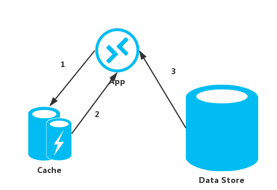

# Cache-Aside
该模式是从数据仓库中将数据加载到缓存中，从而提高访问速度的一种模式。该模式可以有效的提高性能，同时也能一定程度上保证缓存中的数据和数据仓库中的数据的一致性，和同步数据到数据仓库中。

## 问题

应用通过缓存来优化针对数据仓库的重复访问。当然，令缓存中的数据永远和数据仓库中数据保持一致是不切实际的。应用中的缓存应该事先一些策略来辅助更新缓存保证数据的一致，当然，也需要检测数据过期等情况来进行一定的处理。

## 解决方案

很多商业化的缓存系统都提供read-through和write-through/write-behind的操作。在这些系统中应用从缓存的引用中获得数据。如果数据不再缓存中，请求将透过缓存到数据仓库来获取数据，然后将数据写入到缓存中。任何对缓存中的数据的修改，在之后也会写会到数据仓库之中。

对于那些不提供这个功能的缓存系统，就轮到应用来自己将数据保持在缓存之中了。
应用可以通过实现Cache-Aside策略来实现read-through的功能。这个策略会根据需要来从数据仓库获取数据。下图则是Cache-Aside模式的基本运行方式：



1. 判断读取的项目是否在缓存中
2. 如果项目不再缓存中，从数据仓库中将数据读出来
3. 将新的项目写入缓存

如果应用不是读取信息而是更新信息，它可以模仿write-through的策略：

1. 将信息的更新同步到数据仓库
2. 令缓存中关联的过期数据失效

当这个数据在下一次需要的时候，使用Cache-Aside模式将会在获取数据的时候，同时从数据仓库中获取数据，并且写到Cache之中。

## 需要考虑的问题

当在实现如下模式的时候，需要考虑一些问题：

1. **缓存数据的生存时间**：很多Cache实现了过期的策略的，这些过期的策略可以实现数据的更新，将旧数据失效化，同事也令一定时间没有访问的数据失效。为了让Cache-Aside模式能够生效，开发者必须确保过期策略能够正确匹配应用所访问的数据。同时注意不能让过期时间太短，因为太短的过期时间会令应用频繁的从数据仓库中来获取数据来添加到Cache之中。当然，也不要配置超时的时间太长，过长的超时时间会让缓存的数据荣誉。Cache的性能是跟其相关的数据的读取周期等信息高度相关的。
2. **去除数据**：绝大多数的缓存跟数据仓库比起来，容量是很有限的，所以，如果可以的话，Cache会移除数据。多数的Cache会采用LRU的策略来移除缓存中的数据，当然，移除的策略也是可以自定义的。配置全局的过期属性和缓存的其他属性，可以确保Cache消耗的内存资源是搞笑的。当然，通常不会只配置一个全局的过期策略，。举例来说，不同的缓存从数据仓库中获取资源很昂贵的时候而经常访问的话。
3. **准备Cache**：很多的解决方案会多数情况在应用启动的过程中，就将数据仓库中的数据写入到缓存之中。Cache-Aside模式就算在一些数据过期或者移除的情况下仍然很多时候是很有用的。
4. **一致性**：实现Cache-Aside模式并不能保证Cache和数据仓库之间的数据一致性。因为数据仓库中的数据可能在任何的时候都可能由其他程序锁修改，而这个修改不会及时的反映到Cache上，只有在下一次Cache从数据仓库中更新数据的时候才会有解决这个数据不一致的问题。如果数据仓库中数据频繁由非Cahce程序更新的话，这种问题同步问题hi变得更加明显。
5. **本地（内存）缓存**：Cache也是可以做到应用本身里面的。Cache-Aside模式在一些应用频繁访问相同的数据的时候尤其有效。然而，本地Cache都是应用私有的，是属于每个应用中独有的额外的拷贝。所以这个数据可能很快在不同的应用中就不一致了，所以刷新的频率最好更快来保证一致。在有些情况下可以使用共享的缓存，有的时候也可以使用本地Cache，具体使用哪一种就需要根据实际的场景来判断。

## 什么时候使用Cache-Aside模式

什么时候使用：

* 当Cache不提供原生的Read-Through和Write-Through操作的时候
* 资源的需求是不可预测的时候。Cache-Aside模式令应用可以根据需求来加载数据。对于应用需求什么数据，不需要提前做出假设。

## 代码举例

在Windows Azure中开发者可以使用Windows Azure Cache来创建一个分布式的由多个应用实例共享的缓存。下面代码中的`GetMyEntityAsync`方法的实现就是一个基于Windows Azure Cache的Cache-Aside模式的实现。这个方法通过Read-Through的方式从缓存中获取数据。
一个对象通过一个整数ID作为Key来限定。`GetMyEntityAsync`方法根据这个key生成了一个字符串Key(Windows Azure Cache API是通过字符串来作为Key值的)，然后尝试通过这个缓存来获取对应的对象。如果找到了匹配条目，那么就直接返回匹配条目，如果缓存中没有匹配条目，`GetMyEntityAsync`方法会从数据仓库中获取对象，然后将这个对象添加到缓存之中，然后再返回这个对象（下面代码从数据仓库中获取代码的部分是省略了的，因为整个模式跟数据仓库的访问是独立的）。需要注意的是，缓存的条目是配置按过期顺序的，防止缓存长期不更新也不被使用造成资源浪费。

```
private DataCache cache;
...
public async Task<MyEntity> GetMyEntityAsync(int id)
{
    // Define a unique key for this method and its parameters.
    var key = string.Format("StoreWithCache_GetAsync_{0}", id);
    var expiration = TimeSpan.FromMinutes(3);
    bool cacheException = false;
    try
    {
        // Try to get the entity from the cache.
        var cacheItem = cache.GetCacheItem(key);
        if (cacheItem != null)
        {
            return cacheItem.Value as MyEntity;
        }
    }
    catch (DataCacheException)
    {
        // If there is a cache related issue, raise an exception
        // and avoid using the cache for the rest of the call.
        cacheException = true;
    }
    // If there is a cache miss, get the entity from the original store and cache it.
    // Code has been omitted because it is data store dependent.
    var entity = ...;
    if (!cacheException)
    {
        try
        {
            // Avoid caching a null value.
            if (entity != null)
            {
                // Put the item in the cache with a custom expiration time that
                // depends on how critical it might be to have stale data.
                cache.Put(key, entity, timeout: expiration);
            }
        }
        catch (DataCacheException)
        {
            // If there is a cache related issue, ignore it
            // and just return the entity.
        }
    }
    return entity;
}
```

> 上面的例子使用了 Windows Azure Cache的API来访问数据仓库和从Cache中获取数据。想了解更多关于Windows Azure Cache API的信息，可以参考MSDN上面的[使用Windows Azure 缓存](http://msdn.microsoft.com/library/windowsazure/hh914165.aspx)。

下面展示的`UpdateEntityAsync`方法展示了如何令应用修改缓存的数据失效的。这也是Write-Through方法的一个举例。其中的代码会更新数据仓库，然后通过调用`Remove`方法来移除数据仓库中的数据。

> 注意：在下面的一些操作的顺序是十分重要的。如果缓存先被移除了，然后缓存才更新的话，客户端在获取数据的时候会有一定的概率
直接从数据仓库里面获取还没有更新的过期数据。

```
//C# 
public async Task UpdateEntityAsync(MyEntity entity) 
{  
    // Update the object in the original data store  
    await this.store.UpdateEntityAsync(entity).ConfigureAwait(false);  
    
    // Get the correct key for the cached object.  
    var key = this.GetAsyncCacheKey(entity.Id);  
    
    // Then, invalidate the current cache object  
    this.cache.Remove(key); 
} 

private string GetAsyncCacheKey(int objectId) 
{  
    return string.Format("StoreWithCache_GetAsync_{0}", objectId); 
}

```