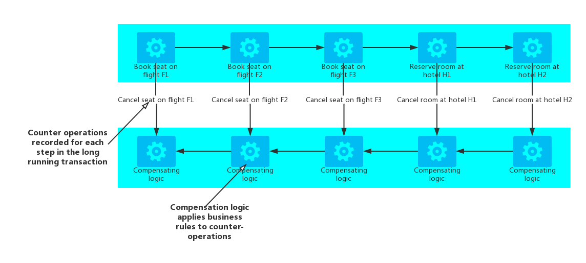

# Compensating-Transaction

在应用中，会将一系列相关的操作定义为一个连续的操作，当其中一个或者多个步骤失败的时候，Compensating-Transaction模式会重置(回滚)这个连续的操作。在云应用中，这些需要保证一致性的操作是较为常见的，正是这些操作构成了复杂的业务处理和工作流。

## 问题

云中运行的应用会频繁的修改数据。数据可能会传播到另外一组数据源，但是数据库却可能在不同的地方。为了避免竞争并且增加诸如此类分布式环境的性能，应用应该尽量少的提供强事务一致性的功能。应用可以实现*最终一致性*的。在*最终一致性*模型中，大多数业务操作都会包含多个自主的子步骤。这些子步骤在执行的过程中，整个系统的状态可能是不一致的，但是当所有的子步骤都执行完毕的时候，整个系统状态会重新变成一致的。

> 在**Data Consistency Primer**章节中对分布式事务的规模化，以及设计最终一致模型的一些准则提供了更多的信息。

在最终一致模型中，一个严峻的问题就是一旦其中一个步骤发生了严重的错误，该如何处理。一旦发生了严重的错误的话，回滚之前的工作就十分必要了。然而，数据是无法简单的回滚的，因为其他应用的并发实例可能在那之后仍然改变数据再次覆盖。甚至就算是并发实例的状态并没有改变的情况下，回滚也不是简单的恢复到原始状态就能解决的。可能还需要应用一些应用所特有的逻辑。

如果实现了最终一致性的操作会跨越多个数据仓库的话，回滚这个操作就需要按相反的顺序重新访问所有数据仓库了。而每个数据仓库的回滚操作也必须完成，才能防止系统出现数据的不一致。

并不是所有的实现数据一致性的操作访问的数据都在同一个数据库中的。在SOA环境中，一个操作很可能会调用另一个Service服务，从而引起另一个服务状态的改变。为了回滚之前的操作，调用的Service的状态也必须回滚。这可能就会需要再次调用Service，并且执行相反的操作才可以。

## 解决方案

基于前面的问题，可以考虑实现Compensating-Transaction模式。在Compensating-Transaction模式中，所有的步骤都必须能够重置之前的工作。Compensating-Transaction可能无法仅仅通过将之前的状态替换掉现在的状态这种方式来回滚，前面已经提到过了，因为这个方法可能会覆盖或者被其他并发实例的操作所覆盖。所以，回滚必须相当的智能，考虑到所有并发应用实例所造成的影响。同时这种回滚行为通常是与应用相关的，要取决于应用执行操作的一些具体的特性。

通常实现最终一致性的操作就是通过workflow来补偿之前的操作。随着操作的进行，系统记录每一步所执行的信息，以及操作执行后该如何回滚。如果操作在任何一个步骤失败了，workflow会倒回所有已经完成的操作，并根据记录的信息进行回滚。需要注意的是，Compensating-Transaction没有必要按照之前执行顺序的逆序来依次执行回滚操作，Compensating-Transaction可能将某些操作以并行的方式来完成的。

> 这个方法类似于*Sagas策略*，具体可以参考[Clemens Vasters的博客](http://vasters.com/clemensv/2012/09/01/Sagas.aspx)

Compensating-Transaction本身也是一种最终一致性的操作，所以也可能会失败的。系统应该能够同样在Compensating-Transaction失败的步骤进行重试和继续执行。有时候，重复之前失败的操作也是很有必要的。所以Compensating-Transaction中的操作都应该定义为**幂等**的操作。关于幂等的更多的信息，可以参考[幂等模式](http://blog.jonathanoliver.com/2010/04/idempotency-patterns/)。
在一些情况下，可能是无法以非手动的方式来执行回滚的。在这些情况下，系统就需要发出报警，并且提供足够的信息给操作人员，让操作人员可以了解产生错误的原因，以及如何恢复回来。

## 需要考虑的问题

在实现Compensating-Transaction模式的时候，需要考虑如下的问题：

* 在考虑实现最终一致性的时候，有时判断某个步骤是否失败可能很难。因为其中的一步可能不是立刻返回失败信息，而是持续的阻塞，所以考虑使用一些超时的机制是十分必要的。
* 补偿逻辑是很难抽象和泛华的。所以Compensating-Transaction一般都是基于应用特性的，这也令Compensating-Transaction十分依赖应用的业务，只有足够的信息才能回滚每个失败的步骤。
* 开发者实现Compensating-Transaction的时候最好将其中的每一个步骤都定义为幂等的。这样可以在Compensating-Transaction回滚中某些步骤失败的时候可以从容的进行重试，而不用担心重试操作会影响到服务的状态。
* 整个架构要处理正常流程中操作和Compensating-Transaction必须是可恢复的。补偿逻辑所需要的信息不可或缺。而且架构必须能够可靠地监控补偿逻辑的处理过程。防止出现循环等状况。
* Compensating-Transaction只补偿失败步骤之前执行成功了的操作。
* 在Compensating-Transaction的回滚过程中，回滚操作的执行顺序不必非要以之前执行的顺序的逆序来依次回滚。比如，如果其中一个数据仓库对于数据一致性更加敏感，那么优先补偿该数据仓库就更为重要。
* 最好在每个需要完成操作的资源上面加上一个超时锁，并且提前获取相应的资源，这样可以增加整个事物的成功率。而所有的工作最好在获取了全部的资源之后再执行。所有的操作必须在锁过期之前全部完成。
* 将[Retry模式](../Retry/retry-pattern.md)同时应用可以更好的减少错误，从而减少回滚操作。如果整个操作中的某个步骤失败了，尽量将这个失败当成一个临时错误来进行重试。只有当操作不断的失败或者无法修复的时候再去执行Compensating-Transaction的回滚操作。
> 关于实现Compensating-Transaction中的很多问题，其实跟实现最终一致性所需要考虑的是一样的。可以查看Data Consistency Primer来了解更多的内容。

## 何时使用该模式

当某个操作中一旦出现失误必须回滚的时候可以考虑这个模式。如果可能的话，最好尽可能减少Compensating-Transaction的复杂性，更多信息可以参考Data Consistency Primer。

## Compensating-Transaction使用举例

某个旅游网站支持用户来预订行程（包括机票以及酒店等）。一个行程可能包含多个航班以及酒店信息。假设一名旅客需要从西雅图到伦敦，然后到巴黎，在飞回西雅图的话，可能就会产生如下的行程：

1. 预订某航班F1从西雅图飞往伦敦。
2. 预订某航班F2从伦敦飞往巴黎。
3. 预订某航班F3从巴黎飞往西雅图。
4. 预订伦敦的某个酒店H1
5. 预订巴黎的某个酒店H2

尽管上述的每个操作都是一个独立的原子行为，但是他们也构成了一个最终一致性操作。因此，随着上述操作的执行，系统也必须记录所有执行过的操作的补偿操作，一旦旅客想要取消行程，就要撤销整个之前的操作。所以这些补偿的操作就可以作为一个Compensating-Transaction来执行。

需要注意的是，Compensating-Transaction中的步骤其实并不需要完全按照之前执行的相反顺序来依次回滚的。而且Compensating-Transaction中的每个步骤都必须考虑到其相关的业务规则。例如，退订某个航班可能并不会返还给顾客当初所支付的全部金额。

> 在Compensating-Transaction中所执行的回滚操作也可能并行来执行的，完全取决于每一步的补偿逻辑具体是如何设计的。

在有些商业解决方案中，系统中某个步骤的失败也并不会破事整个系统，所以不需要通过Compensating-Transaction来回滚全部操作。仍然拿上面的例子来说，如果在预订了航班F1,F2,F3之后，客户无法预订到酒店H1的房间了，那么更好的选择是给客户提供一个其他酒店的房间而不是取消整个行程了。当然，旅客可能仍然会选择取消，但是这个选择的权利应该交给顾客而不是系统来帮助顾客取消了。

## 相关的其它模式

在实现Compensating-Transaction的时候，下面的模式以及相关信息也可以进行参考：

* **Data Consistency Primer** Compensating-Transaction通常被用来回滚需要实现最终一致性模型的功能。**Data Consistency Primer**中的内容提供了更多关于最终一致性的特性的说明。
* **Scheduler-Agent-Supervisor 模式**。该模式描述了如何实现一个尽可能利用分布式服务以及资源的弹性系统。在很多场景下，也会需要使用Compensating-Transaction来回滚失败的错误。
* **[Retry模式](../Retry/retry-pattern.md)**。Compensating-Transaction实现起来代价是非常昂贵的，所以其中的一些步骤最好包含重试逻辑以便增加最终一致性模型的成功率，减少回滚的概率。