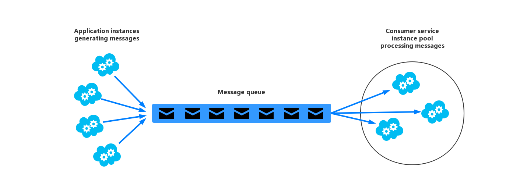

Competing-Consumers模式支持多个并发消费者来处理消费消息队列上接收到的消息。该模式令系统能够并发的处理消息，并且优化吞吐，增加扩展性和可用性，同时平衡工作负载。

## 问题

在云环境中运行的程序可能需要处理大量的请求。相对于同步的处理每个请求，通常更常用的技术是由应用将请求通过消息系统来传给其他的服务(消费者服务)，然后由其他的服务来异步处理。该策略能够确保应用中的业务逻辑不会因为请求的处理而产生阻塞。

请求的数量可能会因为各种各样的原因，在不同的时刻在数量上的差别非常大。突然的大规模的客户行为或者多个代理发送聚合的大量请求都可能引起难以预期的工作负载。在峰值期间，系统可能每秒都需要处理几百个请求。而其他的时间可能需要处理的请求数则大大减少。另外，需要处理这些请求的工作所需要的时间可能相差通常很大。如果只使用一个消费服务，可能会引起消费服务被请求淹没，或者消息系统可能会因为应用涌入的大量的请求而过载等问题。为了处理这种波动的工作负载，系统必须要运行多个消费服务实例。然而，多个消费服务实例也需要谨慎的控制，以确保每个消息仅仅发送给一个消费者。工作负载需要很好的进行均衡，才能确保单个消费服务实例到达性能瓶颈。

## 解决方案

可以考虑使用消息队列来实现应用和消费者服务之间的通信。应用将请求以一定的格式的消息提交到消息队列，然后消费者服务实例接收消息队列中的消息，对消息进行处理。使用该种方式，可以将一个消费者服务调用来订阅一个消息队列。图1展示了该种方式的架构。


图1
使用消息队列来讲工作分发到不同的服务实例上

该种解决方案会带来以下优势：

* 消息队列解决方案本质上就是一种能够处理应用实例接收的请求负载波动较大的一种解决方案。队列在就好似应用实例和消费者服务实例之间的buffer一样，可以最小化当请求发生波动时，对应用实例和消费者实例在可用性和响应性上的影响(在[Queue-based Loading Leveling模式]中有描述)。对于处理某些消息，就算消耗较长的时间也不会阻塞其他消费者服务对于消息的并发处理。
* 消息队列解决方案可以提升系统稳定性。如果生产者直接和一个消费者进行交互，而没有使用该模式，不监控消费者的话，很有可能消息可能会丢失或者在消费者失败的时候失效。在Competing-Consumers模式中，消息是不会发送给特定的消费者服务实例的，失效的消费者实例也不会阻塞生产者，并且消息可以由任何可用的消费者服务实例消费。
* 消息队列模式不需要在消费者之间，或者消费者和生产者之间建立复杂的映射关系。消息队列需要保证的只是消息被交付掉。
* 消息队列模式更容易扩展。系统可以在消息数量波动的时候，动态的增加或者减少消费者服务的实例个数。
* 如果消息队列可以提供事务读操作，那么使用消息队列模式还可以增加弹性。如果消费者服务实例获取和处理的消息是事务的一部分，并且消费者服务实例在处理消息时失败了，使用Competing-Consumers模式可以确保消息会退回到队列中，由其他的消费者服务实例来处理。

## 实现Competing-Consumers模式需要考虑的问题

在决定需要实现Competing-Consumers模式的时候，需要考虑如下问题：

* **消息的排序**。消费者服务实例接收消息的顺序是不保证的，并且也不保证消息创建的顺序和消费顺序是一致的。在设计消息的时候，需要确保消息的处理是幂等的，这样的话可以消除对于消息顺序的依赖。想了解更多关于幂等的消息，可以参考[Idempotency模式](http://blog.jonathanoliver.com/2010/04/idempotency-patterns/)。
> Windows Azure Service Bus队列可以通过使用消息回话实现FIFO顺序的消息机制。关于更多的信息，可以参考MSDN的[Messaging Patterns Using Sessions](https://msdn.microsoft.com/magazine/jj863132.aspx)。


* **考虑服务的弹性**。如果系统需要检测和重启失败的服务实例，那么就一定要考虑将处理过程都实现为明灯的操作，这样可以最小化消息重复获取和处理带来的影响。
* **考虑检测污染的消息**。有问题的消息，或者任务需要请求不可用的资源等等，都会引起服务实例的失败。系统应该组织这种消息返回队列，并且能够捕获消息的详细信息，以便后续对其进行分析。
* **考虑处理结果**。消费者服务实例处理消息和应用产生消息的逻辑是完全解耦的，两者甚至可能都是不直接进行交互的。如果服务实例要求消费者服务对消息的处理必须返回给应用的话，那么这个结果信息就必须存储在某一个消费者服务和应用服务都能访问的地方，并且系统也需要在消费者完成了对应事件的时候对应用进行提示，防止应用访问了没有被消费者处理完成的数据。
> 如果开发者使用Windows Azure服务的话，一个工作进行是可能将消息通过一个专用的响应队列返回的。应用逻辑必须能够将原来的消息和处理的结果关联起来。该场景将在[Asynchronous Messaging Primer](../Asynchronous-Messaging-Primer/asynchronous-messaging-primer.md)中描述更多细节。

* **考虑扩展消息系统**。在大规模解决方案中，如果仅仅使用一个消息队列的话，处理的消息数可能会成为系统的瓶颈。这种情况下，可以考虑将消息系统进行分割，将某个生产者的消息直接对应某个队列，或者使用负载均衡技术将消息分发到不同的消息队列上。
* **考虑消息系统的可靠性**。一个可靠的消息系统必须能够保证，一旦应用入队了一个消息，这个消息是不能够丢失的。这是保证消费者可以处理消息的基础。

## 何时使用该模式

当碰到以下场景时，适合使用Competing-Consumers模式：

* 当应用的工作负载需要分隔成多个任务，并且异步执行的时候，适合使用Competing-Consumers模式。
* 当任务彼此之间是独立的，并且可以并行执行的时候,适合使用Competing-Consumers模式。
* 当工作的负载不太稳定，变化较大，需要可扩展解决方案的时候，适合使用Competing-Consumers模式。
* 当解决方案必须提供很高的可用性，并且能够弹性处理任务失败的时候，适合使用Competing-Consumers模式。

以下场景不适合使用Competing-Consumers模式：

* 当无法简单的将应用的负载分割成离散的任务的时候，或者任务之间存在高度依赖的情况下，不适合使用Competing-Consumers模式。
* 当任务必须同步执行，或者应用的逻辑必须等待任务完成才能继续的情况下，不适合使用Competing-Consumers模式。
* 当任务必须以一定的顺序来执行的时候，不适合使用Competing-Consumers模式。

> 一些消息系统支持会话机制，允许生产者将消息聚合在一起，由同一个消费者来处理。这种机制可以用来优化消息（如果支持该功能）来实现对消息进行排序，让某个消费者以一定的顺序来执行生产者发送的消息。

## 使用举例

*Windows Azure*系统存储队列和服务总线队列，可以用来实现Competing-Consumers模式。应用将消息发送给消息队列，然后由消费者任务从队列中获取消息并进行处理。为了拥有更好的弹性，服务总线队列可以令消费者在从队列中使用`PeekLock`模式中获取信息。使用`PeekLock`模式并不会直接移除消息队列中的信息，只是将其隐藏起来，令其对消费者不再可见。而最初消费消息的消费者可以在其完成消息处理之后，将消息从消息队列移除。如果消费者不可用，`PeekLock`会之后因为处理的超时，将消息重置为消费者可见，允许其他消费者消费。

> 关于更多使用*Windows Azure Service Bus*队列的详细信息，可以参考MSDN上面的[Service Bus Queues, Topics, and Subscriptions](http://msdn.microsoft.com/library/windowsazure/hh367516.aspx)。关于更多使用*Windows Azure*存储队列的信息，可以参考[How to use the Queue Storage Service](http://www.windowsazure.com/en-us/documentation/articles/storage-dotnet-how-to-use-queues-20/).

下面的代码来自`CompetingConsumers`解决方案中的`QueueManager`中的代码，其中介绍了如何令开发者在*web*或者*worker*的启动事件中通过使用`QueueCient`实例来创建队列。

```
private string queueName = ...;
private string connectionString = ...;
...
public async Task Start()
{
    // Check if the queue already exists.
    var manager = NamespaceManager.CreateFromConnectionString(this.connectionString);
    if (!manager.QueueExists(this.queueName))
    {
        var queueDescription = new QueueDescription(this.queueName);
        // Set the maximum delivery count for messages in the queue. A message
        // is automatically dead-lettered after this number of deliveries. The
        // default value for dead letter count is 10.
        queueDescription.MaxDeliveryCount = 3;
        await manager.CreateQueueAsync(queueDescription);
    }
    ...
    // Create the queue client. By default the PeekLock method is used.
    this.client = QueueClient.CreateFromConnectionString(
    this.connectionString, this.queueName);
}
```

下面的代码片段展示了应用如何创建和将消息发送到消息队列。

```
public async Task SendMessagesAsync()
{
    // Simulate sending a batch of messages to the queue.
    var messages = new List<BrokeredMessage>();
    for (int i = 0; i < 10; i++)
    {
        var message = new BrokeredMessage() { MessageId = Guid.NewGuid().ToString() };
        messages.Add(message);
    }
    await this.client.SendBatchAsync(messages);
}
```

下面的代码展示了一个消费者服务实例以事件驱动的方式从队列中获取消息。`ReceiveMessages`函数的参数参数`processMessageTask`是一个代理，当消费者接收到消息的时候就会执行。方法是以异步的方式执行的。

```
private ManualResetEvent pauseProcessingEvent;
...
public void ReceiveMessages(Func<BrokeredMessage, Task> processMessageTask)
{
    // Set up the options for the message pump.
    var options = new OnMessageOptions();
    // When AutoComplete is disabled it is necessary to manually
    // complete or abandon the messages and handle any errors.
    options.AutoComplete = false;
    options.MaxConcurrentCalls = 10;
    options.ExceptionReceived += this.OptionsOnExceptionReceived;
    // Use of the Service Bus OnMessage message pump.
    // The OnMessage method must be called once, otherwise an exception will occur.
    this.client.OnMessageAsync(
        async (msg) =>
        {
            // Will block the current thread if Stop is called.
            this.pauseProcessingEvent.WaitOne();
            // Execute processing task here.
            await processMessageTask(msg);
        }, 
        options
    );
}
...
private void OptionsOnExceptionReceived(object sender,
    ExceptionReceivedEventArgs exceptionReceivedEventArgs)
{
    ...
}
```

另外，*Windows Azure*还支持自动伸缩的特性，可以用来在队列的长度发生波动的时候启动和关闭消费者实例。关于更多的信息，可以参考[Autoscaling Guidance](../Autoscaling-Guidance/autoscaling-guidance.md)。另外，并非一定需要维持一对一的生产者消费者关系，可以存在一个生产实例，多个消费实例的情况。关于更多的信息，可以参考[Compute Resource Consolidation模式](../Compute-Resource-Consolidation/compute-resource-consolidation-pattern.md)。

## 相关的其他模式

在实现Competing-Consumers模式的时候，可以参考如下其他模式：

* [Asynchronous Messaging Primer](../Asynchronous-Messaging-Primer/asynchronous-messaging-primer.md).消息队列本质上就是一种异步通信机制。如果消费者服务需要发送响应给应用的话，可能需要实现一些响应消息。Asynchronous Messaging Primer中描述了更多关于如何通过消息队列实现request/reply类似的消息机制。
* [Autoscaling Guidance](../Autoscaling-Guidance/autoscaling-guidance.md)。有的时候可能需要根据应用消息队列的长度来动态的启动和关闭消费者服务实例。自动扩展可以在峰值期间保证应用的吞吐量。
* [Compute Resource Consolidation模式](../Compute-Resource-Consolidation/compute-resource-consolidation-pattern.md)。有些时候需要将多个消费者实例服务由一个进程管理来降低消耗和管理负载。Compute Resource Consolidation模式描述了这种方法关于利弊之间的权衡。
• [Queue-based Load Leveling模式](../Queue-Based-Load-Leveling/queue-based-load-leveling-pattern.md)。在系统中引入消息队列可以增加弹性，令系统能够处理波动的请求。消息队列可以作为生产者和消费者之间的缓冲区。Queue-based Load Leveling模式描述了这个场景中的更多细节信息。
