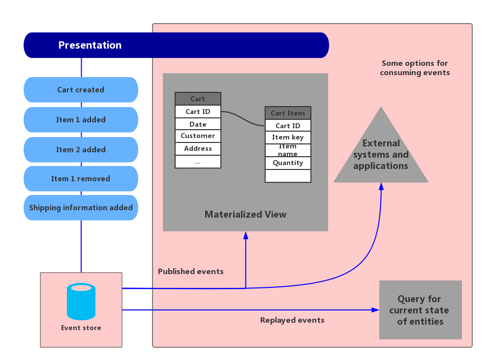

# Event-Sourcing模式

Event-Sourcing模式使用仅附加存储来记录或描述域中数据所采取的动作，从而记录完整的一系列系列事件，而不是仅存储实体的当前状态。因为存储包含全部的事件，可以用来具体化域对象。Event-Sourcing模式可以简化复杂的域中的任务，避免了数据模型和业务领域的同步和引发的争用问题；增强性能，扩展性，以及响应；为事物数据提供一致性；保留全部的事件执行历史，可以跟踪和实现回滚之类的补偿操作。

## 问题

大多数的应用都会涉及到数据的处理，而通常的方法是由应用来保证数据的状态，当用户请求数据的时候，就会更新数据的状态。举个例子，在传统的CRUD模型中，典型的数据处理过程是，从数据仓库读取数据，做出一些修改，使用新的数据更新（通常通过事务来保护数据）当前数据的状态。CRUD的方式会有如下的一些限制：

* 事实上，CRUD系统直接针对数据存储执行更新操作，可能会受到数据仓库的处理开销而影响系统的性能和响应时间，和限制的可扩展性。
* 在许多并发用户的协作域中，数据更新有很大的可能发生冲突，因为更新操作都是发生在单个数据项上。
* 除非有一个额外的检查跟踪机制，它记录在一个单独的日志中的每个操作的详细信息，否则，数据项的操作历史会丢失。

> 想要更深入的了解CRUD架构的一些限制，可以参考微软的[CRUD, Only When You Can Afford It](http://msdn.microsoft.com/en-us/library/ms978509.aspx)一文。

## 解决方案

Event-Sourcing模式定义了一种处理由一系列事件来驱动的数据操作的方法，每一事件都记录在一个仅能追加的存储中。应用将生成一系列事件来描述每一个动作，每个事件对应存储数据发生的变更，然后将这些事件持久化。每个事件都表示一组数据的变化（比如在订单中增加数据项）。

事件可以持久化到事件存储仓库中。事件存储仓库作为对当前数据的状态的数据源或记录系统（数据源或信息的权威数据源）。事件存储通常会发布这些事件，以便可以通知消费者，并在消费者有需要的时候处理它们。例如，消费者可以初始化一些任务将事件中的操作应用于其他系统来执行，或执行完成该操作所需的任何其他相关操作。注意，生成事件的应用程序代码与订阅事件的系统是解耦的。

通常来说，事件存储所发布的事件是用来在应用程序对实体进行修改的时候，更新实体的Materialized视图，并与外部系统集成。例如，系统可以维护所有客户订单的Materialized视图，这些订单信息用于填充UI的部分。当应用程序添加新的订单，添加或删除项目的顺序，并添加航运信息，消费者将处理描述这些变化的事件，并更Materialized视图。

> 参考[Materialized-View模式](../Materialized-View/mvp.md)来了解更多的详细信息。

此外，事件存储可以让应用在任何时候读取事件的历史，并通过对事件历史进行有效地“回放”和消耗有关该实体的所有事件来计算实体的当前状态。很多时候，可能会因为客户端请求，或通过一个预定的定时任务，来重新计算实体的当前状态。其中，定时任务可以将计算的状态生成Materialized视图，并存储起来来提高查询效率。

图1展示了Event-Sourcing模式逻辑的概览图。其中也包括了使用事件流来创建一个Materialized视图，并与其他外部应用和系统集成，以及通过重复事件流来展示某些实体的当前状态。

图1. 关于Event-Sourcing模式的例子和概览

Event-Sourcing模式有很多的优点，包括：

* 事件都是不可变对象，并且存储在一个仅支持追加的队列中。任何用户界面，workflow，或者程序触发了产生事件的行动，都可以以非阻塞任务继续执行，并且这些任务可以都在后台持续执行。这一点，可以令结合事务执行过程中不会产生任何争用，可以极大地提高应用程序的性能和可扩展性，特别是对于用户界面的展示。
* 事件是描述事件发生的简单对象，以及描述事件所代表的动作所需的相关数据。事件不会直接更新数据存储区，它们只是在适当的时候进行记录的生产者。这些方面都可以简化系统的实现和管理。
* 事件通常在某些领域都有各自的特殊含义，相对而言，对象可能只是和数据库的表相对应的，是无法表示其在领域中的真实意义的。表只能表示系统的当前状态，而表现不了发生的事件。
* Event-Sourcing可以有效减少并发更新所引起的冲突，因为Event-Sourcing避免了直接更新数据存储区中对象状态的要求。当然，域模型仍然需要设计来保护其自身的一致性。
* 仅追加的时间存储可以提供Trace的线索，用来监测对数据存储区所采取的行动，并在任何时间计算当前实体状态的Materialized视图或执行事件的回放，协助测试和系统调试。此外，使用补偿事件取消更改的要求提供了一个逆转状态的历史记录，如果模型只存储当前状态，补偿回滚是无法实现的。事件列表也可用于分析应用程序性能和检测用户的行为趋势，以获得其他有用的业务信息。
* Event-Sourcing的事件存储解耦了其生产者（产生事件的任务）和消费者（生成Materialized视图的任务等），为系统的提供了更好灵活性和可扩展性。例如，处理事件存储所发布的事件只知道事件的性质和包含的数据。执行任务的方式与触发事件的操作是解耦的。此外，可以使用多个任务可以处理事件。这一特点使得事件仓库可以很容易的配合其他服务和系统进行集成，只需要侦听由事件存储引发的新事件即可。然而，Event-Sourcing往往是非常低的level，如果有必要的话，可以对基础事件进行简单的聚合再来配合其他系统进行集成。

> Event-Sourcing通常都是配合[CQRS模式](../CQRS/cqrs.md)来执行数据管理任务的。

## 实现Event-Sourcing模式的问题和顾虑

当在考虑实现Event-Sourcing模式的时候，需要考虑如下一些问题：

* 整个系统在创建Materialized视图或通过回放事件数据生成预测的时候都是不一致的，只能满足最终一致性的。应用程序将事件添加到事件存储区的过程与处理请求的结果、正在发布的事件以及处理它们的事件的消费者之间存在一些延迟。在此期间，描述实体的新的更新的新事件可能才到达事件存储区。
> 可以参考[Data Consistency Primer](../Data-Consistency-Primer/data-consistency-primer.md)来了解最终一致性方面的信息
- 事件存储是不可变的信息源，因此事件数据不应该被更新的。更新实体以撤消更改的唯一方法是向事件存储添加补偿事件，就像在交易系统中使用负事务一样。如果持久化事件的格式（而不是数据）需要更改，比如在迁移过程中，将存储中的现有事件与新版本事件相结合很难。可能需要遍历所有事件的变化使事件符合新的格式。考虑在事件结构中定义版本，并对每个版本上使用版本标记，以维护新旧事件的不同格式。
* 多线程应用程序和多个应用程序实例都可能在事件存储区中存储事件。事件存储中事件的一致性是至关重要的，因为这将影响特定实体的事件顺序（实体发生变化的顺序影响其当前状态）。在每一个事件中都添加一个时间戳，可以帮助避免问题。另一个常见的做法是每一个产生的事件都标记一个增量标识符。如果两个操作试图同时为同一实体添加事件时，则事件存储可以拒绝与现有实体标识符和事件标识符相匹配的事件。
* 在遍历事件来获取信息这方面，是没有标准的方法或者一些诸如SQL查询的內建机制的。数据的提取只能通过标识符，获取事件流的方式来。事件ID通常映射到单个实体。一个实体的当前状态，只能通过回放所有涉及对该单位的原始状态的事件来计算出来。
* 事件流的长度也会影响管理和更新系统。如果事件流很大，计算负载高，可以考虑每隔一定的时间间隔创建快照，例如指定的事件数。这样，实体的当前状态可以从快照和重放那个时间点之后发生的任何事件中获得。

> 想了解针对数据建立快照方面更多的信息，可以参考Martin Fowler的*Enterprise Application Architecture website*以及[Master-Subordinate Snapshot Replication on MSDN](http://msdn.microsoft.com/en-us/library/ff650012.aspx).

* 即使事件获取将数据冲突更新的可能性降到最低，应用程序仍然必须能够处理可能通过最终一致性和事务缺乏而出现的不一致。例如，表示库存减少的事件可能到达数据存储区，而该项目的还在进行下单，从而导致协调两个操作的出现冲突，就需要应用能够处理这种类似的冲突；可能需要通知客户撤单或创建回订单。
* 事件发布可能发生多次，所以事件的消费操作必须是幂等的。事件的消费者必须能够处理重复的通知操作。例如，如果一个实体的某一个属性由多个应用实例维护，比如订单总数，那么，当下订单的时候，必须只有一个成功增加订单总数的事件的发生。虽然这不是Event-Sourcing的固有特性，但是通常来说，实现Event-Sourcing都要考虑这一点。

## 何时使用Event-Sourcing模式

Event-Sourcing模式很适合以下场景：

* 当开发者希望捕获数据中的“意图”、“目的”或“原因”时，很适合使用Event-Sourcing。例如，对客户实体的更改可以记录为一系列特定的事件，如搬家、关闭账户等。
* 当尽量减少更新数据的发生争用的时候，使用Event-Sourcing是很合适的。
* 当开发者希望记录发生的事件，并能够重放它们以恢复系统的状态；使用事件来回滚系统变更；或简单地将事件作为历史和审计日志等情况下，均适合使用Event-Sourcing模式。例如，当任务涉及多个步骤时，您可能需要执行回滚某个更新的操作，然后重新执行一些步骤，使数据重新恢复到一致状态。
* 当使用事件是应用程序运行的一个自然特性，并且不需要太多的额外开发或实现工作的时候，使用Event-Sourcing模式很合适。
* 当开发者需要将输入或更新数据的过程与应用这些操作所需的任务解耦时，适合使用Event-Sourcing模式。这种方式也可以用来改善UI性能，或者将事件分发给其他监听器，如其他应用程序或服务，来进行集成。
* 当开发者想能够根据需求灵活改变Materialized模型和实体数据的格式的情况下，当开发者需要在使用[CQRS模式](../CQRS/cqrs.md)的时候，适配读模型或者视图的时候。
* 当配合[CQRS模式](../CQRS/cqrs.md)共同使用时，接受最终一致性的延迟，以及允许根据事件重新计算读模型或者Materialized视图的状态的情况下，也可以使用Event-Sourcing模式

Event-Sourcing模式在如下的情况下不太适用：

* 领域模型很小，或者业务较为简单，系统只有很少或没有业务逻辑，或非域系统，与CRUD架构就能很好满足需求的情况下，不适合使用Event-Sourcing。
* 系统对一致性和实时更新的数据视图要求较高的时候，不适合使用Event-Sourcing模式。
* 系统不需要审计跟踪、历史和回滚和重放操作的功能的时候，因为复杂性的原因，不适合使用Event-Sourcing模式。
* 数据更新冲突很少的情况下，并不适用于使用Event-Sourcing。例如，系统的主要工作是添加数据而不是更新数据的情况。

## 使用举例

某个会议管理系统需要跟踪完成预订的会议，该系统可以在某个希望参加会议的人尝试申请参加的时候，检查是否还有空闲座位。该系统可以以至少两种方式来存储预定库存的总数：

* 该系统可以将预订库存总量的信息作为一个单独的实体在存储在数据库中。可以预订或取消，系统可以适当的增加或减少这个数字。这种方法在理论上是很简单，但是如果大量的预定的人在很多的时间内试图预订的座位的话，可能导致扩展性问题。例如，在预订期结束之前的最后一天内，可能有大量的预定请求。
* 该系统可以将预订和取消的事件存储到数据仓库中。库存总量可以通过遍历这些事件的来计算。由于事件的不变性，这种方法的可扩展性更好。系统只需要能够从事件存储区读取数据，或将数据添加到事件存储区。关于预订和取消事件的信息不会修改的。

图2显示了如何使用Event-Sourcing来实现会议管理系统的座席预订子系统。

图2在会议管理系统中使用Event-Sourcing获取座位预订信息

保留两个座位的动作顺序如下：
1. 用户界面发出一个命令，为两位与会者预留座位。该命令由一个单独的命令处理程序处理（一个与用户界面解耦的应用逻辑，负责处理作为命令发送的请求）。
2. 通过请求所有的预定和取消会议的事件，来获取一个包含全部预定信息的数据集合。这个数据集合叫`SeatAvailability`，并支持查询其中的库存信息。
> 可以使用快照来做一些优化（因此开发者不需要查询和重放事件的完整列表以获取的`SeatAvailability`的当前状态），并在内存中维护聚合的缓存副本。
3. `CommandHandler`调用由域模型的方法来预定或取消。
4. `SeatAvailability`记录包含座位库存。下一次计算库存数时，将遍历所有的预订时间来计算还有多少库存。
5. 该系统增加的新事件会存储在事件仓库中。

如果用户希望取消座位，该系统遵循类似的过程，由命令处理程序产生一个取消座位的事件并将其添加到事件存储中。除了提供了更好的扩展性外，事件仓库为所有的预定和取消操作都保留了操作历史，无论是为了跟踪，或者分析挖掘，都提供了良好的支持。因为事件仓库中记录的事件是真实的唯一来源。系统没有必要持久化其他的状态信息，因为可以很容易地重新遍历事件并计算任何时间点实体状态。

> 开发者可以在[Introducing Event Sourcing](http://msdn.microsoft.com/en-us/library/jj591559.aspx)中更详细的了解这个例子。

## 相关的其他模式

当考虑实现Event-Sourcing模式的时候，也可以参考如下相关模式：

* **[CQRS模式](../CQRS/cqrs.md)**.CQRS实现中所提供的不可变信息源的写存储通常就是基于Event-Sourcing模式的一种实现。CQRS模式描述了如何将操作，读取数据和应用程序的操作，通过使用单独的更新数据的接口来分离职能。
* **[Materialized-View模式](../Materialized-View/mvp.md)**.在Event-Sourcing模式中所使用的数据仓库，通常来说是不利于查询的。通常提高查询效率的方式，就是每隔一定的时间，根据数据仓库生成预填充的视图来提高查询效率。Materialized-View模式描述了改功能是如何实现的。
* **[Compensating-Transaction模式](../Compensating-Transaction/compensating-transaction-pattern.md)**. 在实现Event-Sourcing模式中的数据仓库中的数据是不会执行更新操作的，通常，都会通过增加额外的事件来执行回滚等操作，来恢复实体的状态。Compensating-Transaction模式描述如何撤消由前一个操作执行的工作。
* **[Data Consistency Primer](../Data-Consistency-Primer/data-consistency-primer.md)**. 当使用Event-Sourcing时，读数据仓库或者Materialized视图是不会保证实时一致的。相对来说，他们会保证最终一致性。Data Consistency Primer中讲述了分布式数据保证一致性的诸多问题。
* **[Data Partitioning Guidance](../Data-Partitioning-Guidance/data-partitioning-guidance.md)**. 在使用Event-Sourcing的时候，为了提升扩展性，优化性能，减少争用，会考虑对事件存储进行分区。Data Partitioning Guidance中描述了如何将数据进行分区，以及分区中可能产生的问题等。
