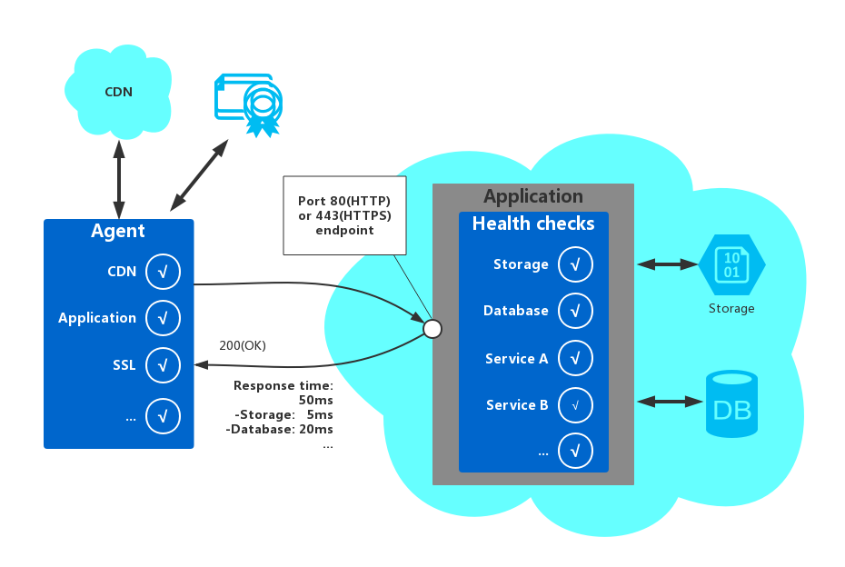

# Health Endpoint Monitoring Pattern

Health Endpoint Monitoring模式是一种用来监控服务健康状态的模式。

Health Endpoint Monitoring模式通过在应用内额外暴露一个可以进行功能检查的接口来实现，可以由外部工具定期访问暴露在外部的端点来检查服务的状态。该模式可以有效验证服务是否可用。

## 问题

监控应用的状态通常是一种很好的应用实践。通常来说，也是业务的一个需求。针对一些中间层和共享的服务也同样如此。因为这样可以有效确认服务在正确工作。然而，监控运行在云上面的服务要比监控一般的服务更复杂。举例来说，开发者是没有服务器环境的全部权限的，并且服务通常还会依赖于一些其他平台的服务，监控起来更难。

在基于云环境的应用会受到很多不同因素的影响，比如网络延迟，存储系统的系能和可用性，以及不同云之间的网络带宽等等。服务可能会因为各种各样的原因全部失败，或者某个环节失败掉。因此，开发者必须每隔一段时间就验证一下服务是否正确，以确保应用能够提供保证服务等级协议。

## 解决方案

一般通过将请求发送到应用端暴露的接口来实现应用Health的监控。应用应该执行一些基本的检查，并且返回应用当前状态的一些信息。

健康检查通常会包含两个基本点：由应用执行的针对服务的状态的检查，以及针对健康检查请求所产生应答的分析。应答的返回code表示了应用的状态，并且，可以额外提供一些他使用的组件或者服务的信息。监控工具或者框架来完成一些服务响应时间的检查。
下图显示了该模式的实现的大概结构：



应用中用来监控服务健康状态的检查可能还会包括以下内容：

* 检查云存储或者数据库的可用性以及响应时间。
* 检查其他应用中依赖的一些服务或者资源，比如应用所使用的，但是不在应用中的资源。

很多服务或者工具都是通过提交请求到指定的端点来获取对应的响应，并且通过分析响应结果来监控web应用的配置以及健康状态的。通常来说，创建一个职能仅仅检查系统的服务端点是相对简单的事情。

监控工具所执行的常规检查可以包括如下一些：

* 检查返回响应的`code`。举例来说，HTTP 200就表示应用响应至少没有内部错误（HTTP 500）。监控系统也支持其他响应代码来给出更为详细的诊断信息。
* 检查响应的内容来检查错误，有的时候就算是HTTP返回`code`是200，但是服务可能仍然是不正确的。这些额外内容可以检查一些web页面或者是服务响应的部分错误。比如，检查页面的标题或者检查正确页面所该返回的一些特定信息。
* 衡量响应时间，可以检测网络的延时以及应用执行请求所用的时间。如果响应时间不断上升，可能就表示应用的出现一些问题，比如资源耗尽或者是网络有问题。
* 检查应用所依赖一些服务是否正常，比如应用所依赖的CDN或者全局缓存中的一些内容等等。
* 检查SSL证书是否过期。
* 衡量DNS查找应用URL的时间，可以检测DNS延迟以及DNS的失败。
* 验证DNS查找到的URL。这可以帮助避免通过攻击DNS服务器所产生的恶意的请求重定向。

当然，从不同的地方来发送请求来执行健康检查，并且对比不同地点的响应时间也是十分有效的。理论上，开发者应该监控距离客户很近的地方的健康检查结果，这样可以获取不同地点更为精确的响应性能的检查结果。除了可以提供一个更强大的检查机制，检查结果可能会影响应用程序的部署位置的选择和是否将其部署在多个数据中心。

测试应该也检查所有的应用实例，这样可以确保无论用户路由到哪一台服务器，应用都是可用的。比如说，如果用户的存储是跨越多个数据仓库的话，监控的程序必须检查所有数据仓库可用性。

## 实现Health-Endpoint Monitoring的问题和考虑

当实现Health-Endpoint监控模式的时候，需要考虑如下一些点：

* 首先需要考虑如何验证应答。举例来说，仅仅通过一个HTTP 200的返回码是否足够保证服务是在正确的工作？这只是提供了应用可用性的一个最基本的信息，属于该模式的一个最简化的实现方案，这种方式提供的信息很有限，关于应用的一些操作，数据趋势，以及可能产生的问题都无法获取。
> 最好在当且仅当请求资源找到并且正确处理的时候再返回200状态码。在一些场景下，比如使用一个主要的页面host目标页面的时候，服务器在目标页面没有找到的时候可能也会返回200状态码而非404（Not Found）。

* 同时需要考虑的还有应用暴露的端点的数量。一种方法是公开应用程序的核心服务的至少一个端点，另一个用于辅助或更低优先级的服务，允许对每个监控结果分配不同级别的重要性。也可以考虑暴露更多的端点，比如每个核心服务一个，这样可以提供更细的检测粒度。举个例子，一个健康验证检查可能会检查数据库，存储，以及应用所依赖的外部服务；每一个检查都会要求不同级别的正常运行时间以及响应时间。就算应用的一些外部服务或者后台任务几分钟内不可用，应用也仍然会是正常的。
* 同时还要考虑是否使用同一端点用于监视一般访问，但为健康验证检查设计的特定路径，举个例子，某个端点使用的`/HealthCheck/{GUID}/`路径作为检查地址。这样的话，监控的工具还可以执行一些应用的功能性测试，诸如增加一个新用户注册，登录，落地一个测试订单，同时也验证了端点一般访问是否可用。
* 也需要考虑服务中需要收集信息的类型，以及如何设计请求和应答来返回这些信息。大多数现存的一些工具是只能检查HTTP状态码的。为了了解和验证更多细粒度的信息的话，可能就需要开发者自己来定制一些工具来解析对应的应答。
* 还需要考虑需要收集多少信息。如果在检查期间执行过高的处理的话，可能会因为资源的过度使用而影响到其他使用应用服务的用户。并且，执行时间过长，可能也会令监视应用的工具认为服务因为超时而不可用。多数应用包含一些工具比如错误处理器以及性能计数器会记录一些性能日志，以及一些具体错误信息，而这些已经足够取代健康检查返回的一些验证信息。
* 如何配置监控端点安全性，阻止一些其他外部的访问也是需要考虑的问题之一；这些外部的访问就可能包含一些恶意的攻击，并且暴露服务也可能会有泄漏敏感信息的风险，或者一些DoS攻击。通常，这些安全性配置应该可以灵活配置而不必重启整个应用。可以考虑如下的一些技术：
 - 通过使用验证的方式来增强端点的安全性，验证可以通过在request header中传一些验证性的信息来实现，或者由监控服务的工具来提供权限验证信息。
 - 使用一个模糊的或者隐藏的端点。举个例子，暴露默认应用URL的某个IP，使用非标准的HTTP端口，或者使用一个特殊的复杂的路径，用一个特殊的测试页面来完成健康检查。通常来说，在应用的配置中指定Ip地址和端口号是可以的，并且可以在必要的时候，为DNS服务器服务器添加一些条目来让检测的工具直接指向该Ip地址。
 - 还可以考虑为端点的检查方法传递一个参数或者某种操作模式。根据该参数，应用可以执行特殊的某种测试，或者当参数不被接受的时候，返回一个404（NOT FOUND）错误。这些参数的值可以在应用的配置中设置。
 > DoS攻击通常对于一个单独的端点执行一些基本的功能测试，尤其这些测试会包含应用中的很多操作的时候，是不会有太大的影响的。当然，不要在测试的时候暴露一些敏感的信息。如果一定要返回一些攻击者可能关注的敏感信息的话，那么开发者一定要考虑该如何防止那些非认证请求的访问了。在这种场景下，仅仅使用模糊的端点是不够的。开发者最好考虑使用基于HTTPS的连接并且加密敏感的信息，哪怕是增加一定的服务器资源消耗也是值得的。
* 如何访问需要验证信息的端点也是需要考虑的。很多工具以及框架是不提供配置一些安全信息的。举个例子，Windows的Azure的内置的健康检查特性就无法提供一些验证秘钥。当然，可以使用一些第三方的工具，比如Pingdom，Panopta，NewRelic以及Statuscake来完成验证功能。
* 监控代理在正确的工作也是需要保证的。一种方法是，仅仅由暴露的端点返回一些应用的配置信息，或者一些一些用来测试监控代理的随机数.

> 同时确保系统本身也对自己进行检查，比如一些自带的测试和内置测试，避免工具对正确的结果做出错误的分析。


## 何时使用该模式

Health-Endpoint Monitoring模式最适用于以下的一些场景。

* 监控网站以及web应用来验证其可用性。
* 监控网站以及web应用来检查其是否执行了正确的操作。
* 监控中间层或者一些共享的资源来检测和隔离其他可能影响应用的服务。
* 为了完善一些应用内部的测量工具，比如性能计数器和错误处理器。健康验证检查并不能替代日志和应用的信息收集的需求。测量工具只是为现存框架提供一些额外的有用信息用来分析性能问题和检测错误。然而，它无法提供应用不可用时的所需要的一些必要的日志信息。

## 使用举例

下面代码的例子中，是从`HealthEndpointMonitoring`中的`HealthCheckController`类中截取的。其中包含了一系列的健康检查。

如下代码中的`CoreServices`方法中，执行了一些列的针对应用中服务的检查。如果所有测试的执行都没有任何错误，方法会返回200（OK）的状态码。如果任何一个测试的方法抛出了异常，放回就会返回500（Internal Error）状态码。方法可以选择性的附带一些额外的错误信息。这些信息可以让监控工具或者框架来使用，分析错误产生的原因。

```
public ActionResult CoreServices()
{
    try
    {
        // Run a simple check to ensure the database is available.
        DataStore.Instance.CoreHealthCheck();
        // Run a simple check on our external service.
        MyExternalService.Instance.CoreHealthCheck();
    }
    catch (Exception ex)
    {
        Trace.TraceError("Exception in basic health check: {0}", ex.Message);
        // This can optionally return different status codes based on the exception.
        // Optionally it could return more details about the exception.
        // The additional information could be used by administrators who access the
        // endpoint with a browser, or using a ping utility that can display the
        // additional information.
        return new HttpStatusCodeResult((int)HttpStatusCode.InternalServerError);
    }
    return new HttpStatusCodeResult((int)HttpStatusCode.OK);
}
```

下面的`ObscurePath`方法展示了你可以从应用配置中读取应用的配置信息，并且以之作为端点来执行测试。下面的代码展示了如何接收一个ID作为参数，并且用之来验证请求。

```
public ActionResult ObscurePath(string id)
{
    // The id could be used as a simple way to obscure or hide the endpoint.
    // The id to match could be retrieved from configuration and, if matched,
    // perform a specific set of tests and return the result. It not matched it
    // could return a 404 Not Found status.
    // The obscure path can be set through configuration in order to hide the endpoint.
    var hiddenPathKey =
        CloudConfigurationManager.GetSetting("Test.ObscurePath");

    // If the value passed does not match that in configuration, return 403 “Not Found”.
    if (!string.Equals(id, hiddenPathKey))
    {
        return new HttpStatusCodeResult((int)HttpStatusCode.NotFound);
    }

    // Else continue and run the tests...
    // Return results from the core services test.
    return this.CoreServices();
}
```

下面的`TestResponseFromConfig`方法展示了如何暴露一个端点，并且基于指定的配置来执行检查。

```
public ActionResult TestResponseFromConfig()
{
    // Health check that returns a response code set in configuration for testing.
    var returnStatusCodeSetting = CloudConfigurationManager.GetSetting(
        "Test.ReturnStatusCode");
    int returnStatusCode;
    if (!int.TryParse(returnStatusCodeSetting, out returnStatusCode))
    {
        returnStatusCode = (int)HttpStatusCode.OK;
    }
    return new HttpStatusCodeResult(returnStatusCode);
}
```

## 相关模式

在考虑实现该模式的时候，可以参考以下的相关信息：

* **[Instrumentation and Telemetry Guidance](../Instrumentation-And-Telemetry-Guidance/itg.md)**.服务以及组件的健康状态通常通过探测来检测，但是不止是健康状态，应用的性能以及运行时所发生的一些事件的信息最好也能够收集到。这些信息可以交给健康检测的工具来对健康的状态以另一种维度来显示。而Instrumentation and Telemetry Guidance一文探索了服务远端诊断信息如何处理等内容。