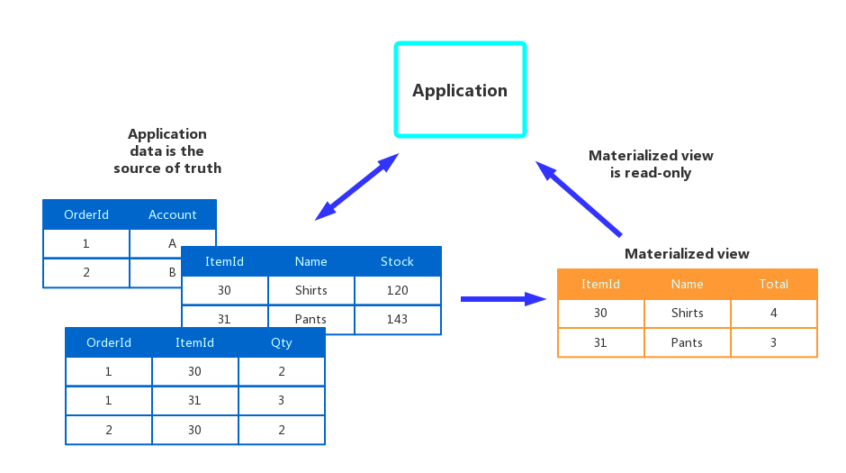
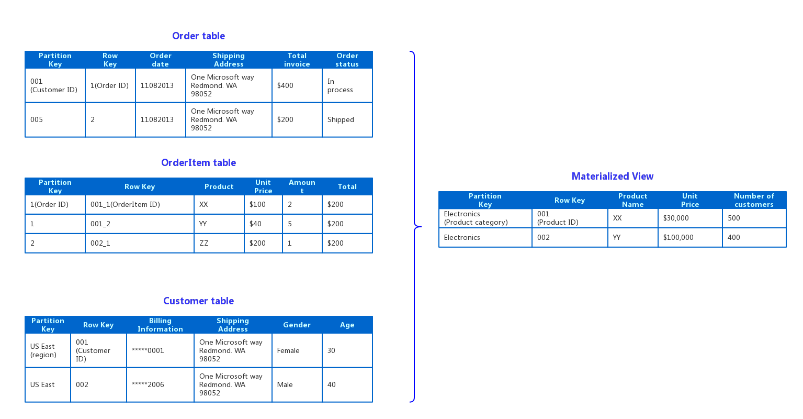

**Materialized-View模式**是在要求数据格式不利于查询操作的情况下，根据多个数据仓库的数据生成预生成的视图的一种模式。这种模式可以帮助支持高效的查询和数据提取，提高应用程序的性能。

## 问题

在存储数据时，开发人员和数据管理员考虑的第一优先级通常集中在如何存储数据，而不是如何读取数据。所选择的存储格式通常与数据的格式、管理数据大小和数据完整性的要求，以及存储的类型密切相关。例如，使用NoSQL存储文档时，数据通常被表示为多个元素的聚合结构，其中包含了所有的实体的信息。

然而，这可能会对查询产生负面影响。当一个查询需要从多个实体的数据获取他们的子集的时候，如需要一些客户的订单摘要信息，但是不需要所有的订单细节，查询仍然需要提取相关实体的所有数据，才能获得所需的信息。

## 解决方法

为了支持高效的查询，常见的解决方法是提前生成所需要的数据格式的结果集。**Materialized-View模式**描述了在那种源数据格式不适用于查询的数据格式，或是生成合适的查询比较困难，或是查询性能低下的的环境中，生成在预填充的视图。

这些Materialized视图只包含查询所需的数据，允许应用程序快速获取所需信息。除了Join表或组合数据实体外，Materialized视图还可以计算列或数据项的当前值、数据项的值组合或执行转换的结果，以及指定为查询的一部分的值等等。一个Materialized视图甚至可以仅针对一个查询进行优化。

Materialized视图的关键就在于它所包含的数据完全是自由使用的，因为它可以完全从源数据存储重建。一个Materialized视图永远不会被应用程序直接更新，所以它实际上是一种特殊的缓存。

当视图的源数据更改时，视图必须更新以包含新信息。更新操作可以通过定时任务来调度，或当系统检测到原始数据的变化时触发。在其他情况下，可能需要手动重新生成视图。

图1.Materialized-View模式

## 问题和实现Materialized-View模式需要考虑的问题

在决定如何实现这个模式时，考虑以下几点：

* 考虑如何以及何时更新视图。理想情况下，每次生源数据发生修改的时候，都会有事件来重新生成Materialized视图。但是在某些情况下，如果源数据迅速变化,可能会导致过多的开销。也可以考虑使用定时任务、外部触发器或手动操作来启动视图的再生。
* 在某些系统中，如使用**[Event-Sourcing模式](../Event-Sourcing/event-sourcing-pattern.md)**来维护仅修改数据的事件的存储时，可能需要Materialized视图。通过检查所有事件来确定当前的状态来预填充视图，可能是事件存储中获取信息的唯一途径。在其他情况下，使用Event-Sourcing时，有必要权衡Materialized-View的优点。Materialized视图往往是专门针对一个或少数查询。如果必须使用许多查询，维护物化视图可能会导致不可接受的存储容量要求和存储成本。
* 当使用定时任务更新视图时，需要考虑数据一致性的影响。如果源数据在生成视图时发生更改，则视图中的数据的副本可能与原始数据不完全一致。
* 考虑存储视图的地方。该视图不必位于与原始数据相同的存储区或分区中。它可以是从几个不同的分区合并的子集。
* 如果视图是短暂的，仅用于通过反映数据的当前状态来提高查询性能，或者提高可扩展性的情况下，可以将视图存储在高速缓存或者不可靠存储上。就算视图丢失也可以根据数据源进行重建。
* 在定义Materialized视图时，通过将数据项或列添加到基于现有数据项的计算或转换、在查询中传递的值或在此适当的值的组合上，将数据项或列添加到视图中，从而最大化其值。
* 如果存储机制支持Materialized视图，可以考虑给Materialized视图加索引以进一步最大化性能。大多数关系数据库支持索引视图，如基于Apache Hadoop的大数据解决方案。

## 何时使用Materialized View模式

Materialized-View模式非常适合以下的一些场景：

* 在需求数据难以直接查询，或者查询必须非常复杂，以便以标准化、半结构化或非结构化方式存储数据的时候，可以考虑创建Materialized视图来优化。
* 当创建临时视图，可以极大地提高查询性能，或可直接作为源视图或数据传输对象（DTOs）的用户界面、报告，或显示的时候，也可以使用Materialized-View模式。
* 需要支持偶尔连接或断开连接的情况，或者数据存储并不总是可用的情况。在这种情况下，可以使用本地所缓存的视图数据。
* 在需要简化查询，并且不需要了解全部数据细节的时候，可以考虑使用Materialized-View模式。例如，通过Join不同的表中的一个或多个数据库，或一个或多个域的NoSQL存储，然后格式化数据以适应其最终用途。
* 需要提供对源数据的特定子集的访问，出于安全或隐私原因，一般不可访问、修改或让数据完全暴露于用户。
* 很多情况下需要根据不同数据仓库的特性来选择数据存储，需要开发者对不同的数据存储进行桥接的时候使用Materialized-View模式十分合适。例如，通过使用作为参考数据存储的高效的云存储，以及提供良好查询和读取性能的关系数据库来保存Materialized视图。

Materialized-View模式在如下场景不适合:

* 源数据很简单或者很容易请求的情况下。
* 源数据变化非常快，或者可以在不使用视图的情况下访问的时候。在这些情况下，创建视图的处理开销可能是可以避免的。
* 一致性是高优先级需求的情况下，使用Materialized-View并不合适。视图并不总是与原始数据完全一致的。

## 使用举例

图2展示了一个使用Materialized-View模式的例子。在Windows Azure存储账户中，Order，OrderItem以及Customer表中不同分区的数据组合了一个视图，生成了一个包含了每种电子产品总销量的数据，同时包含了购买的客户的数量。

图2.使用Materialized-View模式生成销售摘要

创建满足这样需求的视图需要复杂的查询。然而，通过将查询结果显示为Materialized视图，用户可以很容易地得到结果并直接使用它们或将它们合并到另一个查询中。该视图可能被用于报表系统或仪表板，还可以在预定的基础上如每周更新。

> 虽然这个例子利用Windows Azure表存储，许多关系型数据库管理系统也对Materialized视图提供了本地支持。

## 相关的其它模式

在考虑实现Materialized-View模式的时候，也可以参考如下其它模式：

* **[Data Consistency Primer](../Data-Consistency-Primer/data-consistency-primer.md)**.在使用Materialized-View模式的时候，一个重要的需要考虑的问题就是一致性的问题。随着数据的变化，可能无法实时修改Materialized视图所展示的数据的，只能考虑最终一致性的方式。**Data Consistency Primer**总结了很多关于保证分布式数据一致性的内容，也同时描述了不同的一致性模型的实现代价。
* **[CQRS模式](../CQRS/cqrs.md)**.在**CQRS模式**中，所有的更新操作都是以事件的方式执行的，开发者可以通过以响应事件的方式来更新Materialized视图。
* **[Event-Sourcing模式](../Event-Sourcing/event-sourcing-pattern.md)**. 开发者可以配合**CQRS模式**和**Event-Sourcing模式**一起使用来更新Materialized视图中的数据。当Materialized视图所使用的数据源中的数据发生了更新时，系统可以发起事件，并将事件存储到事件存储仓库中。
* **[Index-Table Pattern](../Index-Table/it-pattern.md)**.在Materialized视图中的数据通常来说是通过主键来组织的，但是请求很多时候可能通过视图的其它域来进行检索。开发者可以使用**Index-Table**模式来为那些不支持二级索引的数据仓库创建二级索引。