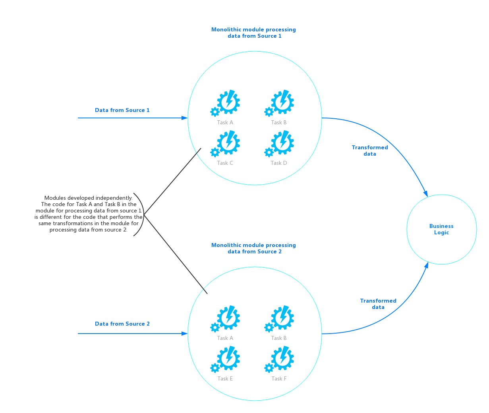
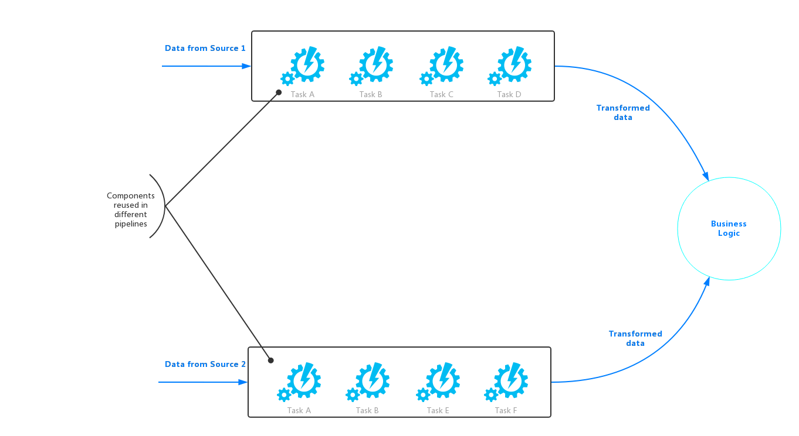
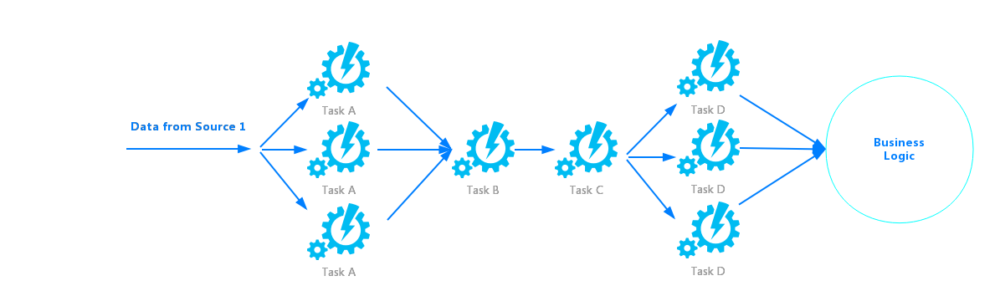
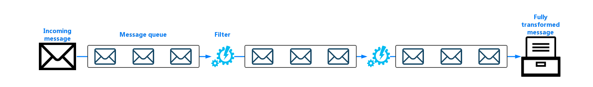

# Pipe和Filter模式

Pipe和Filter模式将执行复杂处理的任务分解为可重复使用的一系列离散元素。这种模式可以提高性能，可扩展性和可重用性，允许执行部署和缩放独立处理的任务元素。

## 问题

一个应用程序可能根据其处理的不同的信息需要执行各种复杂的任务。一个简单的，但不灵活的方法就是可以将应用的处理作为一个单独的模块。但是，如果部分相同的处理需要在应用程序的其他地方，这种方法可能会减少代码重构，重用，优化的机会。

下图1说明了单独模块方法处理数据的流程。应用程序接收和处理来自两个源的数据。每个源的数据由一个单独的模块处理，它们执行一系列任务来转换这些数据，然后将结果传递给应用程序的业务逻辑。


图1.
实现独立模块的解决方案

很多独立模块执行的一些任务在功能上非常相似，但是因为这些模块是分开设计的，实现任务的代码都是紧密耦合在一个模块中，其中的重复部分无法得到重用来提高扩展性和重用性。

然而，每个模块执行的处理任务，或每个任务的部署要求，可能都会随着业务需求的修改而改变。有些任务可能是计算密集型的，可能会受益于运行在强大的硬件，而其他任务可能不需要这样昂贵的资源。此外，在未来可能需要执行一些额外的处理，或命令执行的任务可能会改变。所以需要一个技能解决这些问题，同时也能增加代码重用的解决方案。

## 解决方案

将每个数据流所需的处理分解成一组离散的组件（或过滤器），然后由每个组件来执行一个任务是一种不错的解决方案。通过标准化每个组件接收和发出的数据的格式，这些组件（过滤器）可以组合成一个管道。这种解决方案有助于避免重复代码，并且在需求发生变化的时候，可以很容易地删除，替换或集成额外的组件来实现功能。图2显示了这种结构的一个例子。



图2
通过管道和过滤器的解决方案

处理单个请求的时间取决于管道中最慢的过滤器的速度。尤其在大量请求发送到组件的时候，某个或者某些组件就可能成为系统的性能瓶颈。管道结构的一个主要优点就在于，它为运行缓慢的过滤器提供了使用并行实例的机会，这样使系统能够均衡负载，以提高吞吐量。

组成管道的过滤器完全可以运行在不同的机器上，并且它们可以利用许多云环境提供的弹性能够来实现独立扩展。一个计算密集型的过滤器可以运行在高性能硬件上，而其他要求较低的过滤器可以运行在稍差的硬件上。过滤器甚至不必在相同的数据中心或不在同一个地点，管道解决方案允许管道中的每个元素可以在接近其所需资源的环境中运行。

图3展示了一个应用了管道处理数据流的例子：




图3
管道中组件的负载分担

如果一个过滤器的输入和输出被结构化为一个流，它就有可能对多个过滤器进行并行处理。管道中的第一个过滤器可以开始它的工作，并开始分发它的处理结果，这是直接传递到下一个过滤器的序列之前，第一个过滤器已完成其工作。

另一个好处是管道过滤器模式可以提供很好的跳转。如果过滤器失败或正在运行的机器不再可用，则管道可以重新安排过滤器正在执行的工作，并将此工作直接指向组件的另一实例。一个过滤器的故障并不会导致整个管道的故障。

使用管道和过滤器模式与[事务补偿模式](../Compensating-Transaction/compensating-transaction-pattern.md)相结合，可以提供一种替代的方法来实现分布式事务。分布式事务可以分解成独立的有偿任务，每一个都可以通过使用一个过滤器，还实现了[事务补偿模式](../Compensating-Transaction/compensating-transaction-pattern.md)。管道中的过滤器可以作为独立的托管任务来执行，这些任务还可以在物理位置上接近他们所维护的数据，以降低网络代价。

## 实现管道过滤器模式需要考虑的问题

开发者在考虑实现Pipe和Filter模式的时候，需要考虑以下一些方面：

* *复杂性*。该模式在增加灵活性的同时，也会在复杂性上面带来对应的代价。尤其是当管道中的过滤器分布在不同的服务器的时候。
* *可靠性*。最好使用一个架构技术以确保管道中过滤器之间的数据流不会丢失。
* *幂等性*。如果管道中的某个过滤器在接收消息处理的时候过程中失败了，并且重定向到另一个新的过滤的时候，其中的部分工作可能已经完成了。如果这部分工作包含了更新某些全局状态(比如数据库中存储的一些信息)，同样的更新操作可能会重复执行，这样会带来不一致问题。同样的，当过滤器将其中的一个处理结果发送到下一个过滤器中的过程中发生了类似的错误的话，但是失败的过滤器对于请求的处理可能已经完成了。在这些情况下，所有的工作必须保证能够在重复执行的情况下，也能够保证其结果的一致。当然，这样也可能会令其中的某些过滤器针对同一请求执行多次。因此，在对管道进行设计的时候，必须要保证其幂等性。想了解更多的内容，可以参考Jonathan Oliver的博客[幂等模式]().
* *重复的消息*。如果管道中的一个过滤器在将处理之后的消息发送到下一个过滤器失败的情况下，另一个过滤器会启动(如上面对于幂等性的方面的考虑)，那么该过滤器会将发送额外的一份消息的副本给管道。这可能会造成一个消息的两个相同实例发送给了下一个过滤器。为了避免这一情况，管道应该检测以消除重复的消息。
> 如果开发者在通过消息队列来实现管道技术(比如Windows Azure服务总线队列)，消息队列架构是提供了自动发现消除重复消息的功能的。

* 上下文和状态。在管道中，每一个过滤器都处于一个独立的运行状态，并且不对调用的方式作出任何假设的。这也意味着，每个过滤器必须知道一个消息的足够的上下文信息，来满足其处理的最低需求。这个上下文信息是必须包含了相当多的状态才足够的。

## 何时使用该模式

在以下一些场景的时候，可以考虑使用管道过滤器模式：

* 整个应用的处理可以被分解成一系列离散的，独立的步骤的情况下，可以考虑使用管道过滤器模式。
* 当应用处理的不同的步骤，有不同的扩展性需求的情况下，可以考虑实现管道过滤器模式。
> 当然，将不同的过滤器组合在一起，来统一进行扩展也是可以的。想了解更多这方面的信息，可以参考[Compute Resource Consolidation模式](../Compute-Resource-Consolidation/compute-resource-consolidation-pattern.md)

* 如果需要较强的灵活性的时候，可以考虑使用管道过滤器模式。管道过滤器模式令应用可以灵活的配置不同的执行步骤和执行序列，而且应用还可以按需来增加或者减少对应的处理单元。
* 当需要最大化服务器利用率的时候，可以选择管道过滤器模式。
* 如果解决方案需要保证的可靠，需要尽量降低每一个单独的处理单元中执行的失败的可能性的时候，可以考虑使用管道过滤器模式。

d管道过滤器模式在以下一些场景可能不是十分适用：

* 在应用中处理的一些步骤如果不是幂等的，或者这些步骤必须作为事务的一部分来执行的时候。
* 一个过滤器执行单元在进行处理的时候，需要的上下文的数量或者状态信息已经令其效率低下的时候，不适合使用管道过滤器模式。

## 使用举例

开发者可以选择使用消息队列架构来实现管道过滤器模式。消息队列不断的接收那些没有处理的消息。然后令所有的过滤器组件监听消息队列的消息。当有新的消息来得时候，执行其工作，然后不断的消费消息，并且将处理后的消息添加到下一个队列之中。然后另一个类似的任务同样监听消息队列的消息进行处理，直到整个管道中的过滤器都完成了处理为止。


图4
通过消息队列实现管道过滤器模式

如果开发者是基于Windows Azure来开发的话，可以使用*Windows Azure服务总线*队列来为解决方案提供一个可靠的可扩展的队列机制。下面的`ServiceBusPipeFilter`类就是这样的一个例子。下面的代码展示了一个过滤器如何从队列中接收消息，处理消息，并将结果发送到另一个队列之中。

```
public class ServiceBusPipeFilter
{
    ...
    private readonly string inQueuePath;
    private readonly string outQueuePath;
    ...
    private QueueClient inQueue;
    private QueueClient outQueue;
    ...
    public ServiceBusPipeFilter(..., string inQueuePath, string outQueuePath = null)
    {
        ...
        this.inQueuePath = inQueuePath;
        this.outQueuePath = outQueuePath;
    }
    public void Start()
    {
        ...
        // Create the outbound filter queue if it does not exist.
        ...
        this.outQueue = QueueClient.CreateFromConnectionString(...);
        ...
        // Create the inbound and outbound queue clients.
        this.inQueue = QueueClient.CreateFromConnectionString(...);
    }
    public void OnPipeFilterMessageAsync(
        Func<BrokeredMessage, Task<BrokeredMessage>> asyncFilterTask, ...)
    {
        ...
        this.inQueue.OnMessageAsync(
        async (msg) =>
        {
            ...
            // Process the filter and send the output to the
            // next queue in the pipeline.
            var outMessage = await asyncFilterTask(msg);
            // Send the message from the filter processor
            // to the next queue in the pipeline.
            if (outQueue != null)
            {
                await outQueue.SendAsync(outMessage);
            }
            // Note: There is a chance that the same message could be sent twice
            // or that a message may be processed by an upstream or downstream
            // filter at the same time.
            // This would happen in a situation where processing of a message was
            // completed, it was sent to the next pipe/queue, and then failed
            // to complete when using the PeekLock method.
            // Idempotent message processing and concurrency should be considered
            // in a real-world implementation.
        }, options);
    }
    
    public async Task Close(TimeSpan timespan)
    {
        // Pause the processing threads.
        this.pauseProcessingEvent.Reset();
        // There is no clean approach for waiting for the threads to complete
        // the processing. This example simply stops any new processing, waits
        // for the existing thread to complete, then closes the message pump
        // and finally returns.
        Thread.Sleep(timespan);
        this.inQueue.Close();
        ...
    }
    ...
}
```

在`ServiceBusPipeFilter`类中的`Start`方法连接了一个输入和输出的队列，而`Close`方法则解除了相应的连接。`OnPipeFilterMessageAsync`方法则对消息进行了实际的处理，其中`asyncFilterTask`参数则用来指定要进行的处理。`OnPipeFilterMessageAsync`方法会持续等待输入队列的消息，然后会基于`asyncFilterTask`参数来对接收到的消息进行处理，然后将结果发布到输出队列。队列本身都是通过构造函数来指定的。

一般的解决方案都是将过滤器当做一组工作单元的方式来实现的。每一个工作单元都可以独立的进行伸缩，这都取决于业务的复杂性和其所需要执行处理需要的资源的多少。而且，可以通过对过滤器的并行执行来提高吞吐。下面的代码展示了一个名为`PipeFilterARoleEntry`的*Windows Azure*的工作单元。

```
public class PipeFilterARoleEntry : RoleEntryPoint
{
    ...
    private ServiceBusPipeFilter pipeFilterA;
    public override bool OnStart()
    {
        ...
        this.pipeFilterA = new ServiceBusPipeFilter(
        ...,
        Constants.QueueAPath,
        Constants.QueueBPath);
        this.pipeFilterA.Start();
        ...
    }
    public override void Run()
    {
        this.pipeFilterA.OnPipeFilterMessageAsync(async (msg) =>
        {
            // Clone the message and update it.
            // Properties set by the broker (Deliver count, enqueue time, ...)
            // are not cloned and must be copied over if required.
            var newMsg = msg.Clone();
            await Task.Delay(500); // DOING WORK
            Trace.TraceInformation(“Filter A processed message:{0} at {1}”,
                msg.MessageId, DateTime.UtcNow);
            newMsg.Properties.Add(Constants.FilterAMessageKey, “Complete”);
            return newMsg;
        });
        ...
    }
    ...
}
```

该过滤器中包含了一个`ServiceBusPipeFilter`对象。其中的`OnStart`方法会连接接收消息的输入队列和接收处理完成消息的输出队列(定义在`Constats`类中)。而`Run`方法会调用`OnPipeFilterMessagesAsync`来对每一个接收到的消息进行一些处理(在该示例中，只是简单的等待一段时间)。当处理完成的时候，会生成一个新的消息(在该示例中，只是在属性中增加了部分信息)，然后发送到输出队列。

开发者也可以根据示例代码定义新的`RoleEntryPoint`实现。在实现上，基本不会有太多的差别，只是在其中的`Run`方法中处理略有不同。然后将不同的工作单元连接起来就是一个管道过滤器模式的实现了。参考如下代码：

```
public class FinalReceiverRoleEntry : RoleEntryPoint
{
    ...
    // Final queue/pipe in the pipeline from which to process data.
    private ServiceBusPipeFilter queueFinal;
    public override bool OnStart()
    {
        ...
        // Set up the queue.
        this.queueFinal = new ServiceBusPipeFilter(...,
            Constants.QueueFinalPath);
        this.queueFinal.Start();
        ...
    }
    public override void Run()
    {
        this.queueFinal.OnPipeFilterMessageAsync(
            async (msg) =>
            {
                await Task.Delay(500); // DOING WORK
                // The pipeline message was received.
                Trace.TraceInformation(
                "Pipeline Message Complete - FilterA:{0} FilterB:{1}",
                msg.Properties[Constants.FilterAMessageKey],
                msg.Properties[Constants.FilterBMessageKey]);
                return null;
            }
        );
        ...
    }
    ...
}
```

## 相关的其他模式

在实现管道过滤器模式的时候，可以参考如下一些其他的模式：

* [Competing Consumers模式](../Competing-Consumers/competing-consumers-pattern.md).每个管道可能会包含一个或者更多的过滤器组件。该方法在考虑将过滤器组件并行执行的时候是不错的参考。竞争消费者模式可以令多个组件很好的分担负载提高吞吐量。每个过滤器的事例都可以参与竞争，同时过滤器的多个实例还需要保证不会处理到同一个消息。竞争消费者模式对一些细节进行了详细的描述。
* [Compute Resource Consolidation模式](../Compute-Resource-Consolidation/compute-resource-consolidation-pattern.md).有的时候，可以考虑将多个过滤器组合到一起来一起进行扩展，统一进行伸缩处理。而竞争资源合并模式对该情况在更多细节上提出了一些优劣方面的考虑和权衡。
* [Compensating-Transaction模式](../Compensating-Transaction/compensating-transaction-pattern.md).一个过滤器可以作为一个处理单元来处理，也可能在有些时候需要执行回滚，或者有对应的一些补偿的操作来恢复之前消息的状态。补偿事务模式描述了如何将组件配置实现以保证最终一致性。
