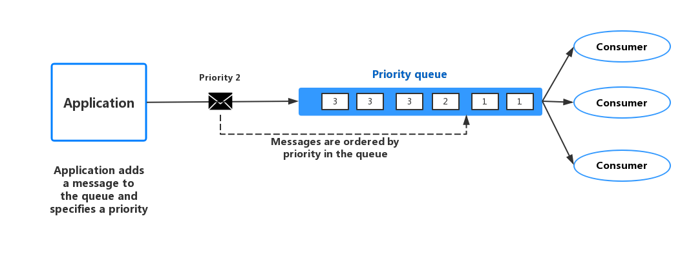
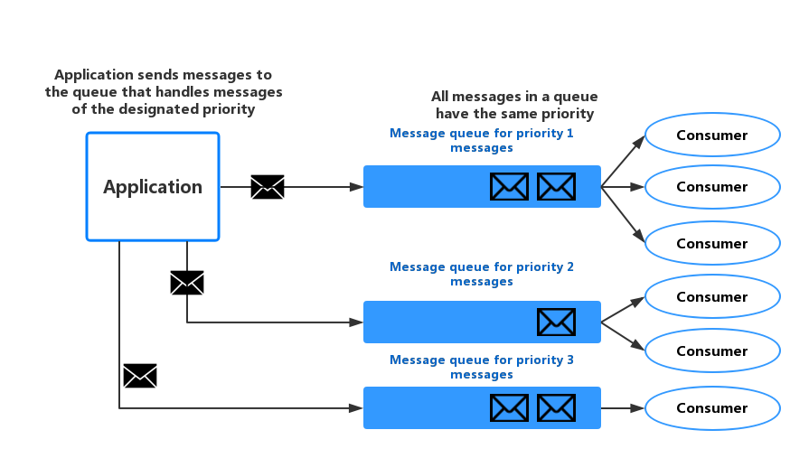
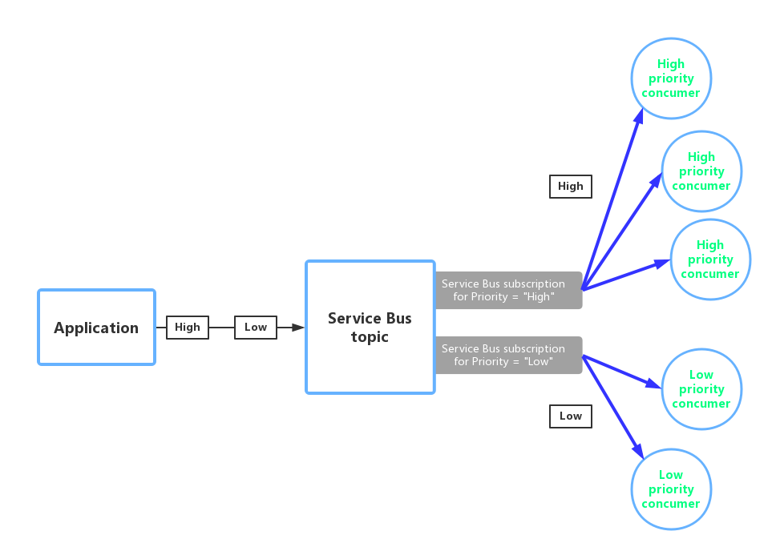

# Priority Queue模式

优先级队列模式：将请求根据优先级进行分流，令高优先级的请求能够比低优先级的请求更快的接收和处理。优先级队列模式对于针对需要根据不同的客户端来实现不同的服务级别的情况下十分实用。

## 问题

应用可能会将某些指定的任务代理到一些其他的服务或应用上面。比如，会存在需要执行一些后台处理，或者与其他应用或者服务集成的情况。在云环境中，通常使用消息队列来代理任务和后台的处理。在很多时候，服务所接收的请求的顺序并不是十分重要的。然而，在一些特殊的场景下，是需要对特殊的一些请求进行优先处理的。这些请求需要比其它请求能够更优先的来处理。

## 解决方案

队列通常来都是属于FIFO的结构，消费者的消费顺序，通常来说和收到信息的顺序也是一样的。然而，有些消息队列是支持优先级处理的。应用在发送消息的时候，会将消息附加一个优先级，然后再添加到消息队列中，这样高优先级的消息会比低优先级的信息优先处理。图1说明了优先级消息队列的处理方式。



图1
使用支持消息优先级的队列机制

> 很多的消息队列实现都是支持多个消费者的(详见[Competing-Consumers模式](../Competing-Consumers/competing-consumers-pattern.md))，并且消费者可以根据需求向上或者向下扩展的。

在那些不支持优先级消息队列的系统中，一种可选择的方案就是在为不同的优先级额外维护一个单独的队列。每个队列拥有各自的消费者。高优先级的队列拥有更多的消费者，并且比低优先级的队列享有更好的硬件。图2展示了该种实现。



图2
为每一种优先级单独维护一条优先级队列

该策略的另一个变种是仅有一个消费者的集合，但是消费者会优先检查高优先级的队列，当高优先级的消息队列存在消息的时候，优先消费高优先级的消息，然后再去消费低优先级的消息。使用一个消费者集合消费多个队列和每一个消费者单独消费一个队列在语义上还是有所不同的。

在仅仅使用一个消费者集合的方法中，高优先级的消息会总是比低优先级的消息优先接收和处理的。理论上来说，很低优先级的消息可能会一直被推迟无法执行的。但是在多个消费者集合的方法中，低优先级的消息仍然是可以消费掉的。只是处理的速度要比高优先级队列的速度要慢（具体的速度区别，要取决于消费池的大小和可用资源的差别）。

使用优先级队列技术可以带来以下好处：

* 优先级队列可以令应用根据业务上的需求来根据可用性和性能来定制优先级。比如需要领服务为指定的客户提供不同的服务级别的情况下。
* 优先级队列可以有效减少操作性消耗。在单一队列方法中，开发者在必要的情况下，可以削减消费者的数量。高优先级的消息将仍然优先处理（尽管处理的更慢），而低优先级的消息可能推迟更久。如果开发者实现了多个消费者队列的方法并每个队列使用单独的消费者，开发者可以减少低优先级队列的消费者数量，甚至暂时挂起很低优先级的队列，为高优先级队列让出更多的资源。
* 多消息队列的方法可以帮助最大化应用的性能，而且可以较为容易的通过分区进行横向扩展。举例来说，一些关键的任务，可以配置高优先级，由接受者立刻处理，而不那么重要的任务，可以由接受者在不太繁忙的情况下运行。

## 实现优先级队列需要考虑的一些问题

在考虑实现优先级队列的时候需要考虑如下问题：

* 为解决方案定义不同的优先权。举个例子，**高优先级**可能意味着消息应该在10秒内处理。根据需求来处理高不同先级的消息，并为不同优先级的情况分配合适的资源。
* 实现优先级队列需要决定是否所有高优先级的请求必须在低优先级的请求之前执行。如果消息都是由一个消费池处理的话，可能需要实现一些机制来抢占执行，以便在高优先级消息可用的情况下，并延迟当前对低优先级任务的处理，优先处理高优先级的任务。
* 在使用多个队列的方法时，如果没有针对每个队列使用单独的消费池，而是使用的是一个消费池来监听所有的消息队列的话，那么消费者必须实现算法来保证消费者总是优先处理高优先级的队列，而不是低优先级的队列。
* 实现优先级队列的时候还需要监控低优先级和高优先级队列的处理消息的速度，来保证队列中消息的处理达到开发者预期的速度。
* 如果开发者需要保证低优先级的任务也需要执行的话，可以考虑使用多个消息队列，每个消息队列都有自己的消费池的方法。当然，如果一个队列支持消息的优化，能够根据消息存在的时间动态的调整消息的优先级的话，也是可以的。但是这种情况下，更多的依赖的是消息队列本身的特性了。
* 当在系统已经定义了少量的优先级的情况下，为每个优先级，使用单独的队列较为合适。
* 消息的优先级可能是由系统的逻辑来决定的。举个例子，相对于明确的高优先级和低优先级的消息，很多系统可能会根据业务的情况将消息定义为“付费客户”或者“非付费客户”。开发者的系统可以根据情况来为付费用户分配更多的资源，而为非付费用户提供较少的资源。
* 查询和处理队列中的消息可能会带来一些额外的费用（有些商业消息系统会在每次发送和接收消息的时候收取少量的费用）。如果使用多个多个队列的话，这些代价也会随之增加。
* 实现优先级队列模式的时候，可以考虑根据队列的长度来动态调整消费池的大小。想了解更多的信息，可以参考[Autoscaling Guidance](../Autoscaling-Guidance/autoscaling-guidance.md).

## 何时使用优先级队列模式

优先级队列模式十分适合以下场景：

* 当系统必须针对不同的任务使用不同优先级来处理的时候，可以考虑使用优先级模式。
* 当系统的不同的用户需要提供不同级别的服务的时候，可以考虑使用优先级模式。

## 使用举例

*Windows Azure*并不提供那种能够通过排序自动调整消息优先级的队列机制。但是，*Windows Azure*是提*供Windows Azure Service Bus*主题和订阅的，*Windows Azure*的服务总线提供队列服务，同时还支持对消息进行过滤等很多灵活的能力，可以很好的支持优先级队列的实现。

*Windows Azure*的解决方案可以将实现一个服务总线，指定一个主题，来支持应用以队列的方式发送消息。消息可以包含应用所自定义的格式的元数据。服务总线的订阅可以根据其主题相关联，订阅可以根据他们自己的一些属性对消息进行过滤。当应用将消息发送到某个主题时，消息会根据消费者的订阅进行转发到指定的消费者。消费者通过订阅来获取消息，就如同从消息队列中获取消息是一样。

图3展示了一个使用了*Windows Azure Service Bus*主题和订阅的解决方案



图3
基于*Windows Azure Service Bus*的主题和订阅的优先级队列实现

在图3中，应用创建了一些消息，并为每个消息指定了一个优先级属性，为`High`或者`Low`。应用将这些消息发送给某个主题。该主题包含两个相关的订阅，通过检查消息的优先级属性来过滤消息。一个消息订阅用来接收优先级属性为`High`的消息，而另一个消息订阅用来接收优先级属性为`Low`的消息。消费池会读取每一个订阅中的消息。高优先级的订阅配置了更大的消费池，这些消费者可以运行在性能更加，使用了更多资源的集群上，而低优先级的消费者运行在性能稍差的集群上。
需要注意的是，在该例子中，我们并没有为高优先级或者低优先级做特别的设计。它们仅仅是以标签存在于每个消息中的属性之中，并且只是用来将消息转发到对应的订阅源的。如果需要增加额外的需求，开发者也可以相对轻松的定制其他的订阅和消费池。

本文也包含了一个可用的`PriorityQueue`解决方案。该方案中包含了2个优先级角色，分别是`PriorityQueue.High`和`PriorityQueue.Low`。他们都继承于类`PriorityWorkerRole`,其中`OnStart()`方法中包含了一些函数用来连接到特定的订阅源。优先级为`PriorityQueue.High`和`PriorityQueue.Low`的消费者连接的是不同的订阅源。管理员可以为每个优先级的消费池进行自定义配置。一般情况下，在`PriorityQueue.High`的消费池中的消费者要更多些。

`PriorityWorkerRole`类中的`Run()`方法将`ProcessMessage(BrokeredMessage message)`作为回调，消费者(`PriorityWorkerRole`)收到了消息的时候，进行回调。下面的代码展示了`Run()`方法和`ProcessMessage(BrokeredMessage message)`。`QueueManager`类，则定义在`PriorityQueue.Shared`项目中，为使用*Windows Azure Service Bus*队列提供一些辅助方法。

```
public class PriorityWorkerRole : RoleEntryPoint
{
    private QueueManager queueManager;
    ...
    public override void Run()
    {
        // Start listening for messages on the subscription.
        var subscriptionName = CloudConfigurationManager.GetSetting("SubscriptionName");
        this.queueManager.ReceiveMessages(subscriptionName, this.ProcessMessage);
        ...;
    }
    ...
    protected virtual async Task ProcessMessage(BrokeredMessage message)
    {
        // Simulating processing.
        await Task.Delay(TimeSpan.FromSeconds(2));
    }
}
```

优先级为`PriorityQueue.High`和`PriorityQueue.Low`消费者都覆盖了`PriorityWorkerRole`中的`ProcessMessage(BrokeredMessage message)`方法。下面的代码是`PriorityQueue.High`消费者的一个例子。

```
protected override async Task ProcessMessage(BrokeredMessage message)
{
    // Simulate message processing for High priority messages.
    await base.ProcessMessage(message);
    Trace.TraceInformation("High priority message processed by " +
        RoleEnvironment.CurrentRoleInstance.Id + " MessageId: " + message.MessageId);
}
```

当应用将消息发送到指定的主题的时候，`PriorityQueue.High`和`PriorityQueue.Low`都会订阅对应主题的消息，应用可以通过指定消息的属性来配置对应的优先级，消费者然后根据优先级来进行过滤获取对应的消息。`QueueManager`中定义的`SendBatchAsync()`方法来分批的将消息发送给配置的主题。

```
// Send a low priority batch.
var lowMessages = new List<BrokeredMessage>();
for (int i = 0; i < 10; i++)
{
    var message = new BrokeredMessage() { MessageId = Guid.NewGuid().ToString() };
    message.Properties["Priority"] = Priority.Low;
    lowMessages.Add(message);
}
this.queueManager.SendBatchAsync(lowMessages).Wait();
...
// Send a high priority batch.
var highMessages = new List<BrokeredMessage>();
for (int i = 0; i < 10; i++)
{
    var message = new BrokeredMessage() { MessageId = Guid.NewGuid().ToString() };
    message.Properties["Priority"] = Priority.High;
    highMessages.Add(message);
}
this.queueManager.SendBatchAsync(highMessages).Wait();
```

## 相关的其他模式

在考虑实现优先级队列模式的时候，也可以同时参考如下文章：

* [Asynchronous Messaging Primer](../Asynchronous-Messaging-Primer/asynchronous-messaging-primer.md)。消费者服务处理请求需要将依赖信息发送给产生消息的应用实例的。Asynchronous Messaging Primer中描述了更多的关于实现基于request/response消息策略的信息。
* [Competing Consumers模式](../Competing-Consumers/competing-consumers-pattern.md)。为了增加队列的吞吐，是很有可能有多个消费者监听同一个队列，并且并行的执行任务的。这些消费者会处理消息，但是每个消费者只能处理一个消息。Competing-Consumers模式中描述了关于实现多个消费者的利弊之间的取舍的信息。
* [Throttling模式](../Throttling/throttlin-pattern.md)。开发者可以通过使用队列来实现节流。优先级消息可以用来确保那些来自于关键应用的请求，能够比那些没有那么重要的应用优先处理。
* [Autoscaling Guidance](../Autoscaling-Guidance/autoscaling-guidance.md)。令消费池的大小随着队列的长度进行自动弹性扩展来处理较多的请求。该策略可以帮助增强性能，尤其是当队列过长时，及时增加高优先级的消费池大小，可以极大的提高吞吐。
