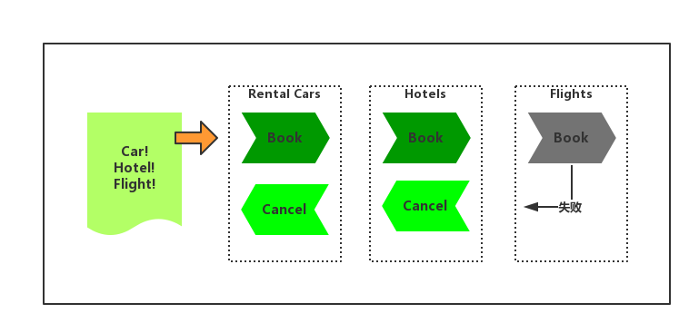

# Sagas

Sagas属于一个错误管理模式，也同时用于控制复杂事务的执行和回滚等。

Sagas的最开始的出现是因为一些长时间的事务的实现（最开始的时候仅仅是因为数据内的事务），现在也包括一些跨越多个区域的分布式事务。这些长时间持续的事务无法简单地通过一些典型的ACID模型使用多段提交配合持有锁的方式来实现。Sagas策略正式用来解决这个问题，和多段式处理不同，Sagas会将工作分成单独的事务，包含正常的操作和回滚的操作。
如下图：



上图展示了一个简单的Saga。如果有旅客预订了行程，需要预订汽车，航班以及旅店。如果无法获取全部的信息，可能最好就是不要出发。对开发者来说，肯定无法将所有的服务都定义为分布式的ACID事务。这时可以将租车行为定义为一个整体，其中包含如何去预订以及如何取消，当然，机票和酒店也提供同样的服务。

然后这些行为可以组合在一起构成了一个行为链。开发者还可以将整个行为链加密，这样只有该行为链的接收者才能够操控这个行为链。当一个行为完成后，会将完成的信息记录到一个集合（比如说，是一个队列）中，之后可以通过这个集合访问到对应的行为。当一个行为失败的实收，行为将本地清理完毕，然后将消息发送给该集合，从而路由到之前执行成功的行为，然后回滚所有的事务。

如果开发者对于旅行行程了解一些的话，就会知道上面的行为链其实是有风险的。一般来说，提前预订租车服务几乎都会成功，因为租车公司都会有足够的时间来帮助你安排车辆。但是预订宾馆就有一些风险了，一般无押金的情况下，只能提前24小时预订，而航班的退改一般情况下还要收费的，所以最后预订是对的。

## 使用举例

下面的程序作为样例可以帮助我们更好的了解Sagas策略

程序会生成一个典型的集合用来访问对应的行为链中的行为，会创建3个独立的进程，每一个进程都会负责一个指定的任务。分别是租车，预订酒店以及预订机票三个独立的任务。

```
static ActivityHost[] processes;

static void Main(string[] args)
{
    var routingSlip = new RoutingSlip(new WorkItem[]
    {
        new WorkItem<ReserveCarActivity>(new WorkItemArguments),
        new WorkItem<ReserveHotelActivity>(new WorkItemArguments),
        new WorkItem<ReserveFlightActivity>(new WorkItemArguments)
    });

    // imagine these being completely separate processes with queues between them
    processes = new ActivityHost[]
    {
        new ActivityHost<ReserveCarActivity>(Send),
        new ActivityHost<ReserveHotelActivity>(Send),
        new ActivityHost<ReserveFlightActivity>(Send)
    };

    // hand off to the first address
    Send(routingSlip.ProgressUri, routingSlip);
}

static void Send(Uri uri, RoutingSlip routingSlip)
{
    // this is effectively the network dispatch
    foreach (var process in processes)
    {
        if (process.AcceptMessage(uri, routingSlip))
        {
            break;
        }
    }
}
```

其中的`AcitivityHost`就是对外部服务的一个抽象，`RoutingSlip`是对前面说的集合的抽象。
下面是具体的一个服务的简化实现，`ReserveHotelActivity`以及`ReserveFlightActivity`的实现就不在此处列出了，下面是`ReserveCarActivity`的实现。其中主要包括的几个方法：

`DoWork`以及`Compensate`方法是Activity抽象出来的用来执行实际操作以及回滚的补偿方法。
`WorkItemQueueAddress`以及`CompensationQueueAddress`都是用来索引到对应服务的。参考如下代码：

```
class ReserveCarActivity : Activity
{
    static Random rnd = new Random(2);

    public override WorkLog DoWork(WorkItem workItem)
    {
        Console.WriteLine("Reserving car");
        var car = workItem.Arguments["vehicleType"];
        var reservationId = rnd.Next(100000);
        Console.WriteLine("Reserved car {0}", reservationId);
        return new WorkLog(this, new WorkResult
        {
            { "reservationId", reservationId }
        });
    }

    public override bool Compensate(WorkLog item, RoutingSlip routingSlip)
    {
        var reservationId = item.Result["reservationId"];
        Console.WriteLine("Cancelled car {0}", reservationId);
        return true;
    }

    public override Uri WorkItemQueueAddress
    {
        get { return new Uri("sb://./carReservations"); }
    }

    public override Uri CompensationQueueAddress
    {
        get { return new Uri("sb://./carCancellactions"); }
    }
}
```

`RoutingSlip`是对成功行为集合的抽象，用来索引到对应的服务，包含了两个队列，一个是完成的任务，一个是等待执行的任务。`RoutingSlip`主要用来控制连接多个行为。如果成功就会将任务向前执行，如果失败就会向后执行
。`RoutingSlip`使用队列来向前执行，使用栈来向后执行。
```
class RoutingSlip
{
    readonly Stack<WorkLog> completedWorkLogs = new Stack<WorkLog>();
    readonly Queue<WorkItem> nextWorkItem = new Queue<WorkItem>();

    public RoutingSlip()
    {
    }

    public RoutingSlip(IEnumerable<WorkItem> workItems)
    {
        foreach (var workItem in workItems)
        {
            this.nextWorkItem.Enqueue(workItem);
        }
    }

    public bool IsCompleted
    {
        get { return this.nextWorkItem.Count == 0; }
    }

    public bool IsInProgress
    {
        get { return this.completedWorkLogs.Count > 0; }
    }

    public bool ProcessNext()
    {
        if (this.IsCompleted)
        {
            throw new InvalidOperationException();
        }

        var currentItem = this.nextWorkItem.Dequeue();
        var activity = (Activity) Activator.CreateInstance(
            currentItem.ActivityType);

        try
        {
            var result = activity.DoWork(currentItem);
            if (result != null)
            {
                this.completedWorkLogs.Push(result);
                return true;
            }
        }
        catch (Exception e)
        {
            Console.WriteLine("Exception {0}", e.Message);
        }
        return false;
    }

    public Uri ProgressUri
    {
        get
        {
            if (IsCompleted)
            {
                return null;
            }
            else
            {
                return
                    ((Activity)Activator.CreateInstance(this.nextWorkItem.Peek().ActivityType)).
                        WorkItemQueueAddress;
            }
        }
    }

    public Uri CompensationUri
    {
        get
        {
            if (!IsInProgress)
            {
                return null;
            }
            else
            {
                return ((Activity) Activator.CreateInstance(
                    this.completedWorkLogs.Peek().ActivityType)).
                        CompensationQueueAddress;
            }
        }
    }

    public bool UndoLast()
    {
        if (!this.IsInProgress)
        {
            throw new InvalidOperationException();
        }

        var currentItem = this.completedWorkLogs.Pop();
        var activity = (Activity) Activator.CreateInstance(
            currentItem.ActivityType);

        try
        {
            return activity.Compensate(currentItem, this);
        }
        catch (Exception e)
        {
            Console.WriteLine("Exception {0}", e.Message);
            throw;
        }
    }
}
```
`ActivityHost`会调用`RoutingSlip`上面的`ProcessNext`方法来解析下一个行为并正向调用`DoWork()`或者反向调用`Compensate()`方法.

```
abstract class ActivityHost
{
    Action<Uri, RoutingSlip> send;

    public ActivityHost(Action<Uri, RoutingSlip> send)
    {
        this.send = send;
    }

    public void ProcessForwardMessage(RoutingSlip routingSlip)
    {
        if (!routingSlip.IsCompleted)
        {
            // if the current step is successful, proceed
            // otherwise go to the Unwind path
            if (routingSlip.ProcessNext())
            {
                // recursion stands for passing context via message
                // the routing slip can be fully serialized and passed
                // between systems.
                this.send(routingSlip.ProgressUri, routingSlip);
            }
            else
            {
                // pass message to unwind message route
                this.send(routingSlip.CompensationUri, routingSlip);
            }
        }
    }

    public void ProcessBackwardMessage(RoutingSlip routingSlip)
    {
        if (routingSlip.IsInProgress)
        {
            // UndoLast can put new work on the routing slip
            // and return false to go back on the forward
            // path
            if (routingSlip.UndoLast())
            {
                // recursion stands for passing context via message
                // the routing slip can be fully serialized and passed
                // between systems
                this.send(routingSlip.CompensationUri, routingSlip);
            }
            else
            {
                this.send(routingSlip.ProgressUri, routingSlip);
            }
        }
    }

    public abstract bool AcceptMessage(Uri uri, RoutingSlip routingSlip);
}
```

## 相关的其他模式

* **Data Consistency Primer** Compensating-Transaction通常被用来回滚需要实现最终一致性模型的功能。**Data Consistency Primer**中的内容提供了更多关于最终一致性的特性的说明。

