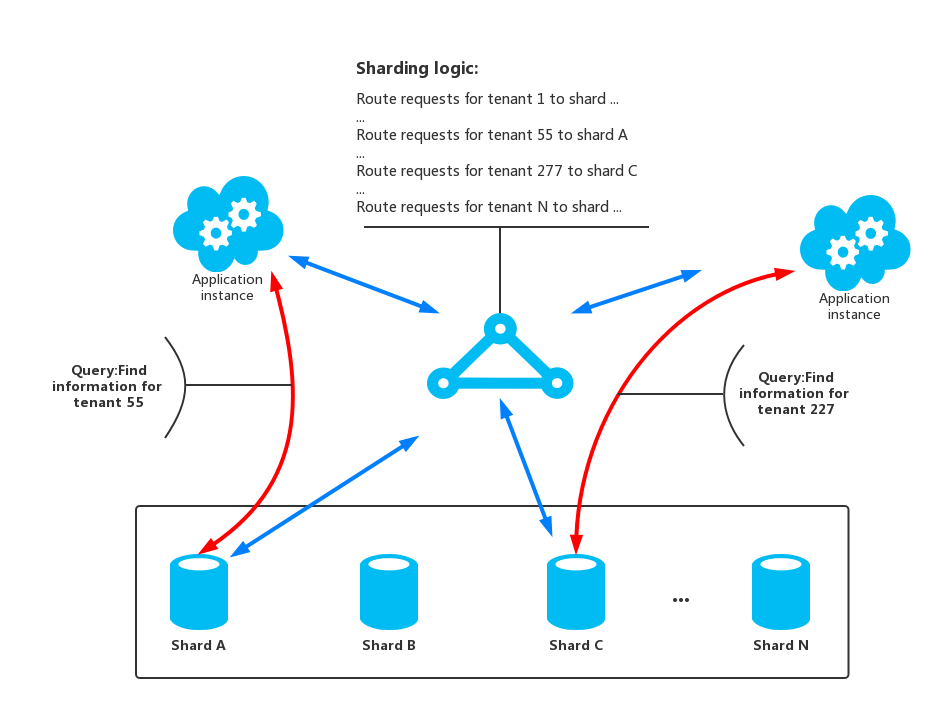
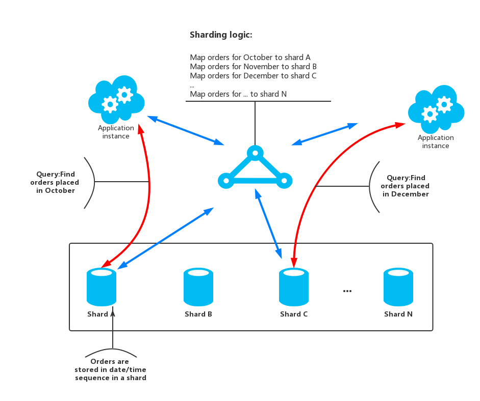
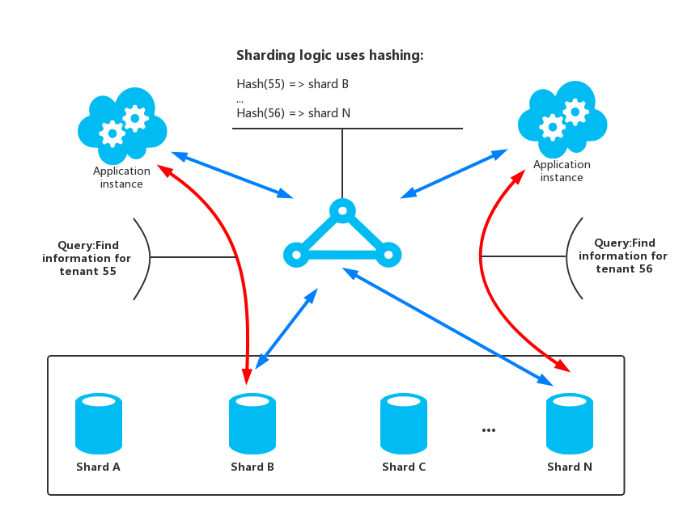

# Sharding Pattern

将数据存储为一组水平的数据分区。这种模式可以在存储和访问大量的数据的时候提高可扩展性。

## 场景和问题

由单个服务器托管的数据存储可能受到下列限制：

* 存储空间限制。基于大规模云应用所使用的数据仓库，可能会包含海量的数据，并且数据增长速度非常的快。一个服务器通常只提供有限容量的磁盘存储，当然它可能是可以替换现有的磁盘与较大的，或添加进一步磁盘到服务器以增加存储量。但是，该系统将最终达到一个硬件的限制，一味地增加在服务器上的存储容量是不可能的。
* 计算资源限制。云应用程序需要来支持大量的并发用户，每个用户都会从数据存储中检索信息。托管数据存储的单个服务器可能无法提供支持该负载所需的计算能力，从而导致用于用户的响应时间的延长以及当尝试存储和检索数据的由于超时所产生的频繁故障。 可以通过添加存储器或升级处理器来缓解计算资源不足的问题，但是当不可能进一步增加计算资源时，系统还会碰到资源不足的问题。
* 网络带宽限制。最终，在单个服务器上运行的数据存储的性能还会受到服务器可以接收请求和发送回复的速度的限制。 可能会因为网络流量超过用于连接到服务器的网络的容量限制，导致请求失败。
* 地理位置的限制。可能处于合法或者性能（减少数据访问的延迟）等原因，需要将特定用户在同一区域中生成的数据存储在同一区域。如果用户分散在不同的国家或地区，可能无法将整个数据存储在单个数据存储区中。

通过添加更多的磁盘容量、处理能力、内存和网络连接来垂直缩放可能会推迟这些限制的影响，但它只是一个临时的解决方案。一个商业云应用程序能够支持大量的用户和大量的数据必须能够无限规模地扩展，所以垂直缩放不一定是最好的解决方案。

## 解决方案

将数据仓库进行分隔来变成多个水平的分区。每个分区(shard)都有相同的结构，但有其自身不同的数据子集。碎片本身就是一个数据仓库（可以包含许多不同种类的实体的数据），在服务器上作为存储节点运行。

这种模式提供以下好处:

* 开发者可以通过增加额外的存储节点来扩展系统。
* 系统可以使用现成的硬件，而不为每个存储节点配置专门的（和昂贵的）计算机。
* 开发者可以通过平衡不同分片的负载来减少争用和提高性能。
* 在云中，分区可以在地理位置上接近访问数据的用户。

当将数据存储进行分隔成分区时，需靠考虑将哪些数据应该放在哪个分区。一个分区通常需要检索一个或者多个一定范围内的数据属性，就由这些属性构成Shard的Key（有时称为分区Key）。Shard的Key应该是静态的。它不应该基于可能改变的数据。

分区在物理存储上组织数据。当一个应用程序存储和检索数据的时候，逻辑的分片指向应用到相应的分区。其实分区逻辑是作为应用数据访问代码的一部分来实现的，当然，如果数据存储系统支持透明的sharding的话，也可以由数据存储系统来实现。

在sharding逻辑中抽象数据的物理位置可以对那个分区包含哪些数据提供一种high-level的控制，同时，使数据在分区之间迁移的时候不需要重新执行应用的业务逻辑（比如分区数据不平衡的时候，进行的重新分布）。当然，其代价是在确定每个数据项的位置时所需的额外数据访问开销。

为了确保最佳的性能和可扩展性，根据应用所执行查询的方式来进行选择合适的分割数据的方案是非常重要的。在许多情况下，是不太可能令分区方案将完全匹配的每个查询的要求。例如，在多租户系统中，应用程序可能需要使用租户ID来检索租户数据，但也可能需要根据其他属性（如租户的名称或位置）来查找这些数据。为了处理这类情况，就需要设计一种合适的Shard key来满足最常执行的请求（最关键的，对性能要求高CRUD操作）。

如果查询定期检索数据结合使用的属性值，可以通过定义组合属性为shard key。另外，使用[Index-Table模式](../Index-Table/it-pattern.md)可以根据没有被Shard Key覆盖的数据进行快速查找。

### Sharding策略

通常在选择shard key和决定如何将数据存入分区使用三种策略。需要提一点的是，分区和对应的服务器是不必一一对应的，服务器可以host多个分区。策略如下：

* 查找策略。在查找策略中，Sharding的逻辑实现了一个请求到包含指定数据分片的路由映射，该映射是通过shard key来计算的。举个例子，在一个租房应用中，承租人通过他们的Id作为shard key来分放在不同的分区。多个承租人信息可能在同一个分区中，但是一个承租人的信息是不会跨越多个分区的。图1显示了这个策略的例子。

图1.基于租户ID对租户信息进行Sharding
Shard key和物理存储之间的映射是基于物理的分区的，每个Shard key映射到一个物理分区。另外，有一种技术虚拟分区技术，在平衡物理分区上提供了更多的灵活性。该技术将每一个shard key映射到一个虚拟的分区上，然后将虚拟的分区映射到少量实际的物理分区。在这种方法中，应用程序通过Shard key定位到虚拟分区来获取对应的数据，然后系统会透明的由虚拟分区映射到物理分区。这样，虚拟分区和物理分区之间的映射可以在不修改应用代码的情况下修改，这样，当应用使用不同的shard key也可以不用修改应用代码。
* 范围策略。范围策略会将一些相关的数据放在同一个分区之中，然后通过shard key进行排序，shard key必须是连续的。
在范围策略中，在应用程序经常进行范围操作十分高效（根据一个shard key返回落在给定范围内的一组数据的查询）。举例来说，如果应用定期需要查找所有指定月份的订单，那么，一旦所有需要获取的数据都放到同一个分区内，性能就会高很多。如果每个订单都在不同的分区，就需要执行大量的查询操作来检索全部数据了（每个请求返回一个数据项）。图2展示了范围策略的例子。

图2.存储连续的数据集合到分区中
在上面的例子中，shard key是一个组合键包括以月份为最重要的元素，其次是订单时间。订单数据在增加新的数据到分区中时，自然就是排好序的。一些数据存储支持Shard key包括分区的Key用来确认分区，一个列Key来区分分区中的数据。数据在分片中通常是根据列Key来进行排序的。需要支持范围查询的数据需要被放入同一个分区，由应用可以根据Shard key来检索所在的分区，然后根据列key来区分分区中的数据。
* 哈希策略。哈希策略的目的是为了减少产生热点的概率。主要是为了将数据尽可能的平均分配到各个分区，以保证不同分区的负载均衡。Sharding逻辑会根据存储数据中的一些属性来计算一个哈希值。选择的哈希函数应该尽可能均分数据到各个分区。图3显示了哈希策略的例子。

图3.基于租户ID对租户信息进行分区
为了理解哈希策略比其他分区策略的优势，考虑一个租房应用连续登记了新的租户，并且将租户信息存储到分区中。当使用了范围分区策略时，租户ID从1到n将会存储到Shard A当中，租户ID从n+1到m会存储到Shard B当中，以此类推。通常来说最近注册的租户也是最为活跃的，那么基于范围策略进行Sharding就会产生热点。然而，哈希策略会将租户信息基于租户ID来写入分区。这也意味着最新注册的租户会写入不同的分区，如上图中的租户55和租户56，这样可以很好的均衡负载。

下表列出了三种策略的优势以及需要考虑的问题：

|策略|优势|需要考虑的信息|
|--- |----|--------------|
|查找策略|对于分区的配置和使用控制粒度更细。<br/> 使用虚拟分区可以减少重新均衡数据所带来的一些问题。因为新的物理分区可以添加到负载中去。虚拟分区和物理分区之间的映射可以在不影响应用代码的情况下进行修改，完全不会影响到应用通过shard key对数据的存储和获取|定位数据所在的分区会带来额外的计算负载|
|范围策略|易于实现，并且在范围查询的时候性能很好，因为所获取的数据通常都来自于同一个分区，只一次IO就可以获取全部的数据<br>易于管理数据。例如，如果在同一区域的用户都在同一个分区，更新可以安排每个时区基于本地负载和需求自由定制。|无法针对分区之间的负载差异进行优化。<br/>平衡分区很困难，并且在大量请求都是基于临近行为的时候，很有可能无法解决负载不均衡的问题。|
|哈希策略|可以更好的平均分配数据，均衡负载。请求路由可以直接通过哈希函数来实现，无需维护请求到分区的映射。|计算哈希值会带来额外的计算负载。<br/>重新平衡分区十分困难。|

最常见的Sharding的方式，就是使用前文所描述的一些方法，但是开发者也需要同时考虑应用的业务需求以及数据的使用模式。还是以租房应用为例：

* 开发者应该根据数据的负载来进行分片。开发者可以将频繁访问，较为活跃的租户信息置于在不同的分区，这样可以提高数据的访问速度。
* 开发者可以根据地点来对租户进行分区。有种场景是某个特定的地理区域的租户在该地区的非高峰时间离线备份和维护数据，而在其他地区的租户的数据保持在线，可以正常访问，这样根据地点来进行分区更适用于该使用场景。
* 开发者可以根据租户的优先级的不同进行分区。将高值信息置于高效的，轻负载的分区，而一些低值数据置于那些一般的分区。
* 如果某些租户的信息需要高度的数据隔离和个人隐私保护的话，那么开发者可以将这些高度敏感的信息置于单独的分区。

### 扩展和数据移动操作

每种Sharding策略在管理向内扩展，向外扩展，数据移动，状态保持等方面，都有着不同的能力级别。

**查找策略**允许扩展和数据移动这些操作操作在用户级别进行，无论是在线或离线的进行。查找策略的技术就在于阻断某些用户的行为（非高峰时段），将数据迁移到新的虚拟分区或者物理分区，修改映射，刷新任何持有数据的缓存，然后恢复之前阻断的用户行为。通常来说，这类操作是可以集中进行管理。查找策略需要高度可缓存的并且友好复制分发的状态。

**范围策略**对扩展和数据迁移操作会带来一定的局限性，通常必须时进行数据存储的一部分或全部下线，因为数据分区必须要继续分割，或者重新合并。如果最活跃的数据是相邻Shard Key或数据的标识符在相同的范围内，那么通过迁移数据来重新平衡分区负载可能无法解决负载不均问题。范围策略同样需要维护一些状态来将一定范围的数据映射到物理分区。

**哈希策略**会令扩展和数据迁移的操作变得更加复杂，因为分区的Key都是基于Shard Key的哈希值。所有新的分区都需要根据哈希值或者是实现映射的函数来计算判定。但是，哈希策略对于状态的保持是没有要求的。

## 问题和顾虑

在使用Sharding的时候，需要进行如下的考虑：

* Sharding和垂直分区和功能分区是相互补充的。举例来说，某个分片可能会包含垂直分区之后的实体，功能分区也可以在多个分片中进行。关于更多分区的信息，可以参考[Data Partitioning Guidance](../Data-Partitioning-Guidance/data-partitioning-guidance.md)。
* 尽量保证分区的负载是均衡的，这样每个分区可以均分IO的负担。随着数据的插入和删除，可能需要定期对分片进行重新平衡各个分区的数据，以减少产生热点的可能。重新平衡数据是一个非常昂贵的操作。为了减少重新平衡数据的操作，开发者应该尽量考虑每个分片的数据空间，保证每个分区的空间足够。同时，开发者应该定制一些策略和脚本，能够在需要的时候，对分区数据进行快速的重新平衡操作。
* 注意使用稳定的数据来作为Shard的Key。如果Shard的key修改了，那么原来的数据也需要在分区之间进行移动，会为更新操作带来额外的工作。因此，不要让Shard的Key包含那些潜在的可能修改的信息。最好使用一些无关的属性，或者键值来构成Shard的Key。
* 确保Shard的Key都是唯一的。例如，避免使用自增域作为Shard的Key。在某些系统中，自增域可能无法在分区中调节，可能会不同分区中，拥有相同的Shard Key.
> Shard Key不包含自动增加的值字段也能产生问题。例如，如果你使用自动递增字段生成唯一的ID，然后两个数据项位于不同的分区可以被分配相同的ID。

* 很多时候，想要设计一个合适的Shard Key来满足所有的需求是不太可能的。只能将数据分区来支持最常执行的请求，如果有一些其他请求需求的话，可以创建第二个Index-Table来支持一些非Shard Key属性的查询。关于更多的信息，可以参考[Index-Table模式](../Index-Table/it-pattern.md)。
* 针对单一的一个分区执行查询获取数据，要比从多个不同的分区获取数据，再Join聚合来获取数据的效率搞很多很多，所以，尽量避免跨越多个分区进行查询操作。需要注意的是，一个分区可以包含多种类型的实体。考虑非规范化你的数据来保证相关的实体是在分片一起查询的（如客户的细节，他们下的订单），以减少应用程序执行的请求数。
> 如果一个分区中的实体引用了另一个分区中存储的实体，那么在设计第一个实体的结构的时候，最好将引用的实体的Shard Key作为结构的一部分。这样可以提高查询引用实体的效率，增加跨分区查询数据的性能。

* 如果应用不得不请求多个分区的数据的话，那么最好通过使用并行的任务来获取数据。比如*[fan-out](../Fan-Out/fo.md)*数据，数据以并行的方式从多个分区获取，然后再聚合成一个结果。然而，这种方法不可避免的增加了数据访问的逻辑的复杂度。
* 对很多应用来说，创建大量的小分区数据要比有少量分区，但是大量数据的分区性能要好，因为小分区更好的均衡工作负载。这种方法也在你需要的分区从一个物理位置迁移到另一个的时候也十分有效。迁移小的分区比迁移大的分区要快得多。
* 确保给每个分区足够的资源来处理扩展性需求所需要的数据规模和吞吐量。关于更多信息，可以参考[Data Partitioning Guidance](../Data-Partitioning-Guidance/data-partitioning-guidance.md)中的**为扩展性设计分区**一节。
* 考虑将分区数据所引用的数据到复制到分区中。如果一个请求从分区请求数据的同时还引用静态或很少修改的数据，那么将这些数据同样添加到分区中。然后，应用程序可以轻松地获取查询的所有数据，而无需对单独的数据存储区进行额外查询。
> 如果引用的数据在其它分区修改了，那么系统必须跨越分区同步这些变动。系统会在进行这些同步的期间产生一定的不一致。如果使用这种方法，开发者需要让应用可以处理这种不一致。

* 保证不同分区之间的数据一致是非常困难的，所以开发者应该尽量减少跨越多个分区的操作。如果应用必须跨越分区修改数据，那么就需要评估数据一致性是否是实际的需求了。通常，在云环境中一般是实现最终一致性来保证数据一致的。每个分区中的数据分别进行更新，由应用的逻辑来负责保证所有更新操作的成功，同时也负责处理更新数据过程中的请求时的数据不一致。想了解更多的关于最终一致性的信息，可以参考[Data Consistency Primer](../Data-Consistency-Primer/data-consistency-primer.md)。
* 配置和管理大量的分区也是一项挑战。诸如监控，备份，检查一致性，记录日志，验证等任务必须在多个不同地区的分区和服务器上完成。这些任务任务通常通过自动化解决方案或者脚本来实现，但是脚本和自动化可能无法消除额外的管理需求。
* 分区可以在地理位置上距离使用分片数据的应用服务器较近。这种方法可以降低网络延时，提高性能，但是对于跨分区访问的操作引入额外的复杂性。

## 何时使用该模式

* 当数据仓库需要扩展，但是单个数据节点的资源有些不足的时候可以考虑使用Sharding模式。
* 当需要提高性能，减少数据仓库中的争用的时候，可以考虑使用Sharding模式。

> Sharding模式主要的重点是在于提高性能和系统的可扩展性，而且它同时也因为数据的独立分区提高了可用性。一个分区中的故障并不会影响应用程序访问在其他分区中保存的数据，并且运维人员可以对一个或多个分区执行维护或恢复，而不会令应用完全不可用。想了解更多相关信息，可以参考[Data Partitioning Guidance](../Data-Partitioning-Guidance/data-partitioning-guidance.md)。

## 举例

下面的例子使用一些SQL Server数据库作为分区。每个数据库持有应用使用数据的一部分。应用从多个分区获取数据。其中`GetShards()`方法返回所有数据所处于的分区。`GetShards()`方法返回了`ShardInfomation`对象的列表，其中`ShardInfomation`类包含了一个Shard的标识符，也包含了一个数据库连接字符串由应用连接到对应的分区。

```
private IEnumerable<ShardInformation> GetShards()
{
    // This retrieves the connection information from a shard store
    // (commonly a root database).
    return new[]
    {
        new ShardInformation
        {
            Id = 1,
            ConnectionString = ...
        },
        new ShardInformation
        {
            Id = 2,
            ConnectionString = ...
        }
    };
}
```

下面的代码展示了应用如何使用`ShardInfomation`对象列表来并行查询数据的。其中具体请求的代码没有展示，但是在例子中，请求客户的名字的信息，如果分区中包括客户信息，就会返回。然后结果聚合到`ConcurrentBag`集合中，等待应用处理。

```
// Retrieve the shards as a ShardInformation[] instance.
var shards = GetShards();
var results = new ConcurrentBag<string>();
// Execute the query against each shard in the shard list.
// This list would typically be retrieved from configuration
// or from a root/master shard store.
Parallel.ForEach(shards, shard =>
{
    // NOTE: Transient fault handling is not included,
    // but should be incorporated when used in a real world application.
    using (var con = new SqlConnection(shard.ConnectionString))
    {
        con.Open();
        var cmd = new SqlCommand("SELECT ... FROM ...", con);
        Trace.TraceInformation("Executing command against shard: {0}", shard.Id);
        var reader = cmd.ExecuteReader();
        // Read the results in to a thread-safe data structure.
        while (reader.Read())
        {
            results.Add(reader.GetString(0));
        }
    }
});
Trace.TraceInformation("Fanout query complete - Record Count: {0}",
results.Count);
```

## 相关的其他模式

在考虑使用Sharding模式的时候，可以参考以下文章：

* **[Data Consistency Primer](../Data-Consistency-Primer/data-consistency-primer.md)**.有些时候，可能需要维护分布在不同的分区数据的一致性。Data Consistency Primer总结了围绕分布式数据保持一致性的问题，并介绍了不同的一致性模型的好处和使用代价。
* **[Data Partitioning Guidance](../Data-Partitioning-Guidance/data-partitioning-guidance.md)**.将数据存储进行分区可能引入一些列的问题，Data Partitioning Guidance中针对云环境数据分区在增加扩展性，降低争用以及优化性能等问题上进行了描述。
* **[Index-Table模式](../Index-Table/it-pattern.md)**.有些时候，仅仅通过设计Shard的Key是无法满足所有的查询请求的。Index-Table模式令应用能够从大量数据中通过非Shard Key来进行快速检索。
* **[Materialized-View模式](Materialized-View/mvp.md)**.为了保证一些查询操作的性能，最好创建一些具体化视图来聚合数据，尤其这些数据是跨越跨越多个分区的时候。Materialized-View模式描述了如何生成和构成这些视图。